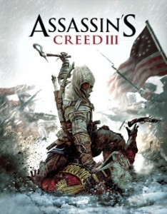

**Rating:** 2/5

This past weekend I had the opportunity of visiting with a brother- and sister-in-law, their daughter, and their newborn son. My brother-in-law also went out and bought [Assassin’s Creed III](http://www.metacritic.com/game/playstation-3/assassins-creed-iii) (AC3)

the day we arrived with the hope of getting at least part way through it over the weekend. We only played the single-player story, so I can’t speak to the new multi-player content.

AC3 is actually the fifth installment in the Assassin’s Creed line. I have thoroughly enjoyed the games from the very beginning. I particularly liked Brotherhood (multi-player!!) and unfortunately never had a chance to play Revelations (though my brother-in-law showed me some of the new gameplay it introduced as well as the ending cinematics). I really enjoyed the overall story elements of the games. It’s not high art, but I thought there were enough interesting ideas and twists to be engaging. We were both really excited to see the new gameplay elements and to continue the story line. Unfortunately we were sorely disappointed.

## The Good

The story elements were great (if a little slow and protracted). While it would have nice to have some aspects more fully fleshed out (more climactic boss encounters and more insight into character motivation), we both enjoyed where the story went and are interested to see how they proceed from here.

## The Bad

Combat was not improved at all. If anything it was simpler and more boring. Yes there were more ranged combat choices, but there was no visible way to really improve or customize your weapons. Combat has never been particularly deep tactically, but this installment was actually a step backwards. The game made it far too easy to successfully counter and there was almost no variety in opponent type—at least, not any variety that changed the way you played.

## The Ugly

There’s unfortunately lots to say here.

1. The game was booooring and simply not fun. There was no excitement! Brotherhood had good stealth missions; Revelations had parachute assassinations in a sequence that ended with combat while in free-fall; AC3 had nothing even close. 1. The stealth missions were lame. I recently played [Deus Ex: Human Revolution](http://www.deusex.com/). *That’s* how you do stealth missions. You need to give the player some degree of strategic depth.

2. The race missions were rage inducing! The final boss battle: the worst such race followed by a no-different-from-any-other-battle button masher. It was the very definition of anti-climactic.

3. Oh, and my favourite were the breathtakingly exciting missions between cut scenes where you were instructed to walk some stupidly short distance from point A to point B, or to escort somebody some stupidly short distance from point A to point B, or to press a button in the middle of a cinematic to finally end it (more below).

4. The game was super, super short. We finished the entire story line (including multiple retries of some extraordinarily frustrating missions) in about 20 hours. There might have been lots of side-quest content, but there was zero motivation to pursue them. Why amass money if there’s nothing to spend it on? Why include the whole homestead customization system (which was never fully explained in game, I must add—we never did figure out how to hire artisans) if it has no meaningful affect on how you play the game?

5. The naval system, while novel, was really nothing. You have a whopping three speeds (including full stop) and a few guns. I never saw any in-game information that led me to believe I could upgrade or otherwise customize my ship. Sure, they say when you first get it that you can add guns, but they never tell you how, and there’s never any need. There are only two mandatory naval missions in the main story line (if I remember correctly), and we completed them on the first try.

6. My biggest complaint goes back to my first one, and that is that the game was hardly a game. It was more like an interactive movie. I am all for great visuals and cinematic cut scenes. I love them. But they don’t make the game. Ubisoft seems to think that you turn a movie into a game by sporadically giving you control, but they never give you control when it matters, when it can affect the story. I’m stuck walking down the hallway to move to the next scene, or a scene tells me to press a certain button (usually when I have my knife at my opponent’s throat), at which point I strike the killing blow, but it’s not like I have a choice. It’s not like I can spare his life. So why bother me with the prompt? Just do it already!

## Conclusion

AC3 was a huge disappointment. The story line was fine, and I liked the twist ending, but the game aspect was a total bust. A super short main story line, combined with little tactical variety and boring missions made it a bargain-bin title in my mind. I certainly won’t be paying full price for the next installment, if they indeed make another one.
