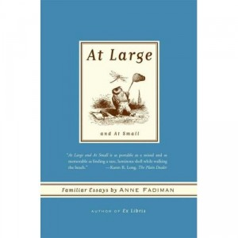

**Rating:** 5/5

Anne Fadiman, *At Large and At Small: Familiar Essays by Anne Fadiman* (New York: Farrar, Straus, and Giroux, 2007).

Another delightful read. While not as intentionally hilarious as *[Ex Libris](../ex-libris-by-anne-fadiman "“Ex Libris” by Anne Fadiman")*, it certainly has it’s guffaw-inducing moments. She’s a tremendous writer and succeeds well at creating vivid imagery. This book is her contribution to the genre of the “familiar essay,” a genre that is intended as an intimate conversation between the author and a single reader. She covers topics from ice cream to coffee and from her crush on Charles Lamb to 9/11. My personal favourites are the essays on ice cream and on being a night owl. My favourite feature, though, is the annotated bibliography at the back separated by essay!! My to-read list just doubled! If you like this genre—and what’s not to like?—then you should certainly get your hands on this collection.
