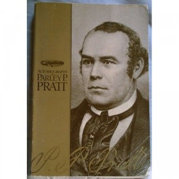

Parley P. Pratt, *Autobiography of Parley P. Pratt* (Salt Lake City: Deseret Book, 1985).

And now for something completely different. As yet I haven’t reviewed any church-related literature, of which I read a great deal. Certainly not because I am ashamed in any way of my faith. Any who know me at all well are aware that I am a proud member of the [Church of Jesus Christ of Latter-Day Saints](http://lds.org). I just don’t want my blog to be a proselyting platform. If you ever wish to talk about religion in general or the LDS Church specifically, drop me a line.

Why I chose to include this book is because it’s not purely doctrinal but is an incredible historical work. Parley (1807–1857) was one of the first apostles of the Restoration, and his history is intimately tied with the history of the Church. His history is a fascinating look at the culture and religious environment of the frontier West. Parley was an elegant and powerful writer. His tract *Key to the Science of Theology* is still a favourite of mine. I think this is a work that every member of the Church should read at some point. Religious affiliations aside, anybody with an interest in nineteenth-century US history (especially religious history) will find this book rewarding. His story moved me deeply. I feel a great debt to him and to the other pioneers that sacrificed so much in establishing the Church I am so grateful to be a part of.
