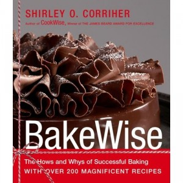

**Rating:** 5/5

Shirley O. Corriher, *BakeWise: The Hows and Whys of Successful Baking with Over 200 Magnificent Recipes* (New York: Scribner, 2008).

Awesome, awesome, awesome! Corriher goes through all the main categories of baking: cakes, meringues, pies, cookies, and breads. She goes through all the ingredients, the chemistry behind how they work, as well as some awesome basic recipes. For people like me who want to take the next baby step from slavishly following recipes to starting to understand how recipes work (and don’t work), this is an awesome book. She goes through alternate techniques and does a great job of giving you the information to decide how to accomplish what *you* want to accomplish. Do you want cookies that spread more or do you want them to set quickly? Do you want fudge-like brownies or cake-like brownies? She tells you what adjustments to make to accomplish it. I can see already that I will not be buying hundreds of recipe books. A handful of good theory books with excellent base recipes and you can do anything. Two thumbs up!
