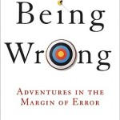

**Rating:** 4/5

Kathryn Schulz, *Being Wrong: Adventures In The Margin Of Error* (New York: Ecco, 2010).

This is a book I read sometime last year but just never got around to reviewing. As the title suggests, it’s a book about fallibility. It’s a relatively lengthy book, but the writing style is clear and engaging, and the book is indeed intended for the general public. Schulz examines why it is that we are wrong so often. How does the brain work? How do we jump to wrong conclusions? Is it a bad thing that we’re wrong so often? (Ironically, no it’s not.) She includes some fascinating (and some heart-wrenching) case studies that add to the book’s interest. I think anyone who reads the book will find something of interest. I strongly recommend the book to those with a particular interest in how the brain works (and sometimes doesn’t) and to those that get down on themselves when they do happen to be wrong. It’s OK! We’re built that way!
