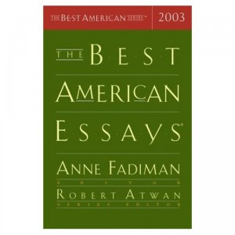

**Rating:** 5/5

Robert Atwan and Anne Fadiman (eds.), *The Best American Essays 2003* (Boston: Houghton Mifflin Company, 2003).

What I am loving most about these essay collections is the diversity. To use a Gumpism, “it’s like a box of chocolates.” There were a handful that I ended up skimming (toffee or peanut butter), and one that just made me sick (orange or cherry), but most were delicious (caramel or mint). They’re also bite sized, so I generally can read one or two on the bus and can stop if one was particularly poignant or thought provoking. In fact, I often don’t read more than a couple in a day just because of the dissonance, sometimes, moving from one to the other. Some make you want to read another and others are really quite filling on their own. I am definitely going to be looking up more of the *Best American* series. I highly recommend this collection and the genre as a whole.
