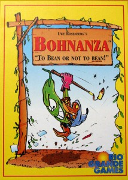
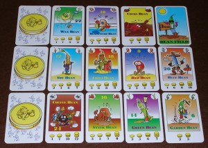

**Rating:** 5/5

 [“Bohnanza”](http://boardgamegeek.com/image/69366/bohnanza "BoardGameGeek.com") by [Rio Grande Games](http://www.riograndegames.com/games.html?id=36 "Rio Grande Games")

If you’ve known me for long, you know I’m an avid gamer. While I enjoy games in any medium, nothing beats face-to-face, tabletop gaming. (I still think [Bridge](http://en.wikipedia.org/wiki/Duplicate_bridge "Wikipedia Entry") is the greatest of man’s creations.) And when it comes to face-to-face gaming with a group of non- or semi-gamers, nothing beats a rousing round of Bohnanza.

Bohnanza is a high-interaction game of bean trading—yes, bean trading. A picture of the fanciful card art is below. Players have a hand of cards, the order of which they may never change. You always plant beans from the front of your hand. You want to use your limited number of bean fields to plant as many of the same kind of bean as possible. This is where hand management comes in. On every player’s turn, there is a negotiation phase where cards are traded. You can trade from anywhere in your hand, so you want to try to consolidate similar beans whenever possible in order to get them planted. Beans are worth varying amounts of gold depending on their common-ness. The player with the most gold at the end of the game wins.

This is a tremendous game with almost no downtime at all. You are almost always interested in trading something, and when you’re not, it’s fun just to watch (and perhaps interfere) with the proceedings. It’s a game that works for almost all ages and temperaments. (We’ve played with kids as young as 8–10.) Playing with different groups will result in a different type of game, too. The player dynamics is the core of the game. The rules are dead simple, and I have yet to meet somebody not excited to play it again. There is a certain amount of luck in the initial dealing of the cards, but overall, a shrewd trader will perform better than an unobservant player. In the end, though, it’s not the winning that matters, but the fun had just in playing. I think everybody should own this game.

N.B.: [http://boardgamegeek.com](http://boardgamegeek.com "Board Game Geek") is the definitive source of information on board games. [You can see my BGG profile and game collection here.](http://boardgamegeek.com/collection/user/Striton) I am always willing to talk about gaming, so never hesitate to contact me with any questions or recommendations.

Bohnanza Cards
