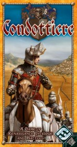

**Rating:** 4/5

[“Condottiere”](http://boardgamegeek.com/boardgame/112/condottiere "BoardGameGeek.com") by [Fantasy Flight Games](http://boardgamegeek.com/boardgamefamily/3400/fantasy-flight-silver-line-games "Rio Grande Games")

Condottiere is a card game of bluffing and second guessing. It has been around since 1995, but I am just now getting around to playing it! 2–6 players (the game works best with 3+) fight to control city states in Renaissance Italy. You do this by playing cards to your battle line. The strongest line wins, but beware the bishop who can hamstring an army in a stroke, the vagaries of winter, or a well timed surrender. This is a very addicting game with agonizing ups and downs and surprising reversals of fortune. I highly recommend this game to groups that like quick games with tactical variety and lots of direct confrontation.
