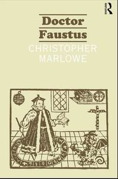

**Rating:** 5/5

Christopher Marlowe, *Doctor Faustus*, ed. John D. Jump (New York: Routledge, 2002).

Dr. Faustus was an actual historical figure. He was apparently an itinerant scholar and fortune teller, and there is some documentation on his life during the first quarter of the sixteenth century. ([See the Wikipedia article for more information.](http://en.wikipedia.org/wiki/Faustus#Sources_of_the_legend)) This documentation suggests that he committed immoral acts while a schoolmaster and that he was particularly arrogant and boastful. As early as 1548, writers associated Faustus with the supernatural, and by 1587 the first “history” of Faustus’s life and death was published (*Historia von D. Johann **Fausten*). This story was widely retold and republished through the eighteenth century. Marlowe’s play is (I think) the earliest dramatic representation of the Faustus story, written and performed circa 1592.

Marlowe’s play is much shorter and to the point than Goethe’s (which is not surprising given the cultural and aesthetic differences of their respective eras). You can read the whole thing in an hour or two.  Because the story is more concentrated, I found this version much more powerful. It is also much more accessible. If you can read Shakespeare (Marlowe’s contemporary), then you will have no problem understanding this text even without editorial notes. It paints a grim picture. Unlike Goethe’s non-traditional ending where Faust is ultimately saved, Marlowe is true to the “proper” ending in which Faustus is indeed damned (and torn to pieces, even). The story also brings up some interesting theological issues that I found quite interesting. Anybody interested in the Faustus story will want to read this play.

I enjoyed the prefatory information of the particular edition my library had. It’s older, but it was very informative and focused. I found the editor’s overview of the play’s structure very helpful and insightful. The typesetting was particularly *a propos*, imitating the style of sixteenth century books, while still being legible by 20th century standards. (I didn’t love the footnote style, though.)

This is a classic story that comes up again and again in literature and critical theory. For the small amount of time it takes to read, I think it’s an excellent investment. This one I went ahead and rated.
