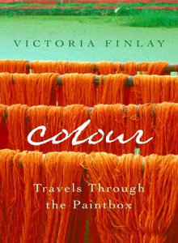

**Rating:** 3/5

Victoria Finlay, *Colour: Travels Through the Paintbox* (London: Sceptre, 2002).

Victoria Finlay is one adventurous woman. From the Australian outback to war-torn Afghanistan, Finlay explores the origins of various colours and how they ended up on canvasses and clothes. It’s not enough for her to simply read and research, instead she must herself visit the places and people involved. The resulting narrative goes beyond simply “the facts” and becomes instead a colourful recounting of a fascinating journey (which includes all the facts too).

Though different people will find some stories more interesting than others, Finlay’s writing is engaging throughout, and the thoroughness of her research is clearly visible. Her narrative style is flowing, at times witty, and always very sensitive to the history and cultures she encounters. The colours she covers are ochre, black & brown, white, red, orange, yellow, green, blue, indigo, and violet. Each receives its own chapter and each contains a remarkably diverse history. The book also contains a fascinating and extensive bibliography.

If you really just want the facts, then this is probably not the book for you. An encyclopedia will give you more direct and concise answers. But if you want not only the history of the colours but a look too at the people and places, if you enjoy a well-written travelogue, then this longer text (450 pages) is sure to satisfy.
