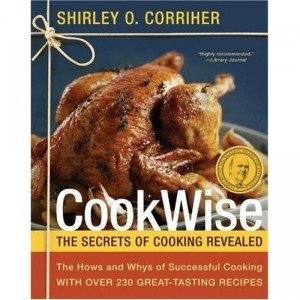

**Rating:** 4/5

Shirley O. Corriher, *CookWise: The Secrets of Cooking Revealed* (New York: William Marrow, 2011).

I thought [*BakeWise*](../bakewise-by-shirley-o-corriher "“BakeWise” by Shirley O. Corriher") was a much better book. Not only does this book (which was written before *BakeWise*, I’ll grant) spend half the book talking about baking, I think the book could have been better organized as well. It’s still a good book and has some great-looking recipes, but I found *BakeWise* to be more intuitively and usefully organized, with more specific information. I’ve decided to hold off on buying this book right now, but it’s at the top of my list of cooking books to get in the near future. You should at the very least go check it out of the library and see what you think.
