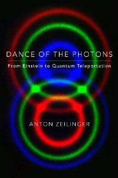

**Rating:** 1/5

Anton Zeilinger, *Dance of the Photons: From Einstein to Quantum Teleportation* (New York: Farrar, Straus, and Giroux, 2010).

I just can’t do it. I’m 100 pages in and I just can’t bring myself to slog through the other 200. I love science books, I am fascinated by physics, and I still want a math degree one day. I was hoping this book would be a good survey of the latest in quantum theory. Well, it doesn’t hack it.

First the editing. One of the jobs of an editor is to make sure the text is easily read, meaning idiomatic English. If I were to publish something in French or Italian, knowing I’m not a native speaker, I would sincerely hope that my publisher would make whatever changes were necessary to make my text easily digestible by the target audience. The publisher here clearly failed. The author is a native German speaker apparently, and his text is essentially a transliteration. There was some basic cleanup done, but the text is rife with superfluous repetition and non-idiomatic inversions of subject/verb/object.

Even if the editing was superb, there is still the issue of writing style. I found the Alice/Bob narratives grating and distracting. (Don’t even get me started on the Prologue!) Zeilinger is trying to be “cute” and humorous, but instead comes across as pedantic and condescending. There’s quite a bit of oversimplification that happens to—“let’s not go into why suchandsuch works this way, let’s just see what it does.” Oh, and the illustrations…hoh boy. I don’t know if the author drew them himself, but whoever did was no artist. Again, I think the intent was to be “cute,” but instead it just looks amateurish and off-putting. None of the illustrations were so complex that any art student couldn’t have done vastly better for a reasonable price.

The fundamental content is interesting, but if properly edited and the narratives reduced, the book would only be half the length. After skimming the rest of the book, there’s not much new being talked about at the end than at the beginning. I am certain there are other recent books on the topic that are more approachable. I will let you know when I find them.
