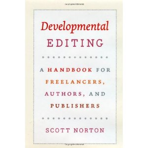

**Rating:** 4/5

Scott Norton, *Developmental Editing: A Handbook for Freelancers, Authors, and Publishers* (University of Chicago Press, 2009).

I’ve never read a book on developmental editing before, so I can’t speak to how it compares to others. I always find it interesting to watch other editors work, though. It’s one of the reasons I love working in house.  I have to admit, some of the edited excerpts gave me pause. There were things I would never think to change. That said, I’m just a lowly copyeditor (and quite happy as such). While I can understand why Norton chose to illustrate his points with lengthy case studies, I found the narrative bits to be quite overdone. I would have preferred a more direct pedagogical approach. One thing missing is a sort of wrap-up or overall checklist summarizing all his key points. My favourite part was the annotated bibliography.

As the title suggests, the book is targeted to a rather narrow audience. If you’re not an editor or an author, don’t rush out and buy this book. But I certainly recommend the book to my editor colleagues.
