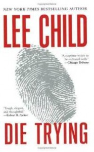

**Rating:** 2/5

Lee Child, *Die Trying* (New York: Berkeley Books, 1998).

I give the first book of a series a lot of leeway, especially if it’s early in an author’s career. But I expect a lot more from the later books. Child disappointed me, I’m afraid. (I suspected as much after reading the cover and fly pages. The “advance praise” blurbs were contrived and non-committal.) He seemed to regress. Gone was the punchy writing style. Gone were the throaty “ho-ho-ho that’s awesome” laughs (well, there were one or two). Maybe I enjoyed the first book just because it was new to me and outside my normal reading fare, but I think it’s more than that.

To start, let me repeat what I said in [my review of the first Jack Reacher novel](../killing-floor-by-lee-child "“Killing Floor” by Lee Child"): I understand these are not books meant to be taken too seriously. They are guilty-pleasure books. You’re supposed to suspend your disbelief a fair bit and just enjoy the ride. I’m not asking for total realism, just a consistency and reasonable-ness that I can hold onto.

1) The characters in the first book were much more distinct and real. I could clearly picture each one. Their behaviours were internally consistent. They were people I could root for. This book seemed to have too many characters, first of all, and, perhaps because of that, few received the attention necessary to really flesh them out. By the end I was having a hard time keeping all the names straight. Other than Reacher and Holly, nobody stood out to me. They were just cardboard cutouts.

2) There were more than a few moments where characters thought or did things so improbable that it really stretched my suspension of disbelief past the breaking point. Let’s take the most egregious one, for example: the one sexual encounter between Reacher and Holly. (This is not a spoiler. The genre essentially demands that it happen.) You cannot convince me that such an event could ever really take place given the context of what had just happened—what they had just seen and done. There were at least three such instances I can think of off the top of my head.

3) The most unforgivable “sin” is his total ruining of any sort of surprise ending. He telegraphed the mole’s identity so loudly, so conspicuously, so early, that you would really have to be sleeping to miss it. And this is coming from somebody that *never* figures stuff like this out. I’m usually enjoying the story so much I can’t be bothered to analyze things. And even when I *do* think I have it figured out, 9 times out of 10 I’m dead wrong. Not here. I read and re-read the offending paragraph numerous times just to make sure I wasn’t jumping to conclusions, but nope. It said exactly what I heard it saying—loud and clear.

Oh, and as an aside, the shrugging thing only gets worse and more conspicuous. Child’s characters must have the sorest shoulders! Every character on just about every page shrugs at least once. Talk about irritating!

The book is not a total write off, though. The action got better at the end, and he does do the description-of-an-event-as-it-happens-in-slow-mo thing—done so masterfully by the new Sherlock Holmes movies—quite well. (Speaking of movies, is anybody else as shocked as I am that they would cast Tom Cruise as Jack Reacher in the upcoming movie series?! Reacher is 6 foot 3 inches tall and weighs 230+ pounds. Tom Cruise is what, 5’5″ and 150 pounds soaking wet?)

I have decided that I will go ahead and read book three just because some of my family members have really, really liked the books. I won’t commit to more than that, though. This is Child’s last chance.
