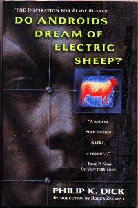

**Rating:** 4/5

Philip K. Dick, *Do Androids Dream of Electric Sheep?* (New York: Ballantine Books, 1996).

There was a lull in the flow of books from the library, so I picked something off my shelf to re-read. I hadn’t read this story for many years. I had forgotten how great it was! Philip K. Dick was as much a philosopher as a sci-fi writer. This book explores themes of posthumanism, empathy, and theology—all in the context of a detective-genre story. It’s almost a short story, not just because of it’s diminutive size but also because of the necessary selectivity the author has to exercise to keep things lean. Some themes are treated in great depth, and others are only lightly touched on. The story does require you to think a little bit. If you take it at face value, you may make an unfair snap judgement. It’s not really a detective/crime story. That’s just the façade. The meat of the story is what’s between the lines. I find the last quarter of the book to be particularly poignant. The ending is pretty open, and it’s not what I’d call happy, either, but it succeeds in that it makes you sit and reflect a bit on what just happened. It’s a really short read—I read it in a single day over a few hours—and I think it’s very worthwhile.

P.S. Yes, this book forms the impetus behind the classic film *Blade Runner*. I must warn you, though, that in all essential ways, the book is nothing like the movie. Ridley Scott took the names of the main characters, the concept of the android-hunting bounty hunter, and…well, that’s about all. The rest really couldn’t be more different. Don’t read this book expecting *Blade Runner*. It’s not here (thankfully).
