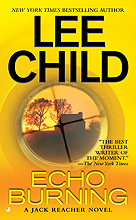

**Rating:** 3/5

Lee Child, *Echo Burning* (New York: Jove Books, 2008).

This is certainly the most boring of the Reacher books so far. There are really only two action set pieces and the rest is just driving around not sure if Carmen is lying or not. It’s a fine book, don’t get me wrong, but compared the the previous four, it’s very slow.

I think I’m going to stop reading Reacher novels for a little bit. These books aren’t meant to be read in such quick succession. Their weaknesses become too apparent. I’ll wait a while before I break out book six.
