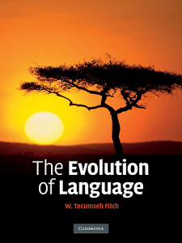

**Rating:** 3/5

W. Tecumseh Fitch, *The Evolution of Language* (Cambridge University Press, 2010).

This is a textbook that surveys the state of  research into the evolution of language. It does a high-level survey of our current understanding of human evolution, and Fitch then goes through seemingly each and every hypothesis on language evolution specifically and explicates their strengths and weaknesses.

Fitch refrains from stating a strong personal preference for any given theory, but you can certainly sense which ideas resonate more with him. His point is that language should be looked at as a confluence of many smaller adaptations and that much can be learned by taking a comparative approach and looking at how each of these smaller adaptations have developed in animals.

Even as a non-linguist, non-biologist, I found the text interesting. I did do a little skimming in some parts, but overall the prose is approachable and engaging. If you are “into” biology, evolution, or linguistics, then this book may be right up your alley. As always, one of my favourite parts was the 83-page (yes, eighty-three-page) bibliography. It took me an hour to read through it, but I found some books I’m really excited to read.

I have to admit, part of me just doesn’t understand how much of this research is relevant to anything. So many of these hypotheses are completely unprovable, yet so much energy is spent creating and debating them. To be fair, one of Fitch’s main arguments for breaking language evolution into more discrete adaptations and taking a more comparative approach is to infuse more empiricism into the study. He calls for testable hypotheses, and I couldn’t agree more. I’m still not convinced some the methods he talks about really give the results he thinks they do, but I totally recognize that I’m the ignoramus here.

Anyway, if you have interests in evolution, language evolution in particular, consider checking this one out.
