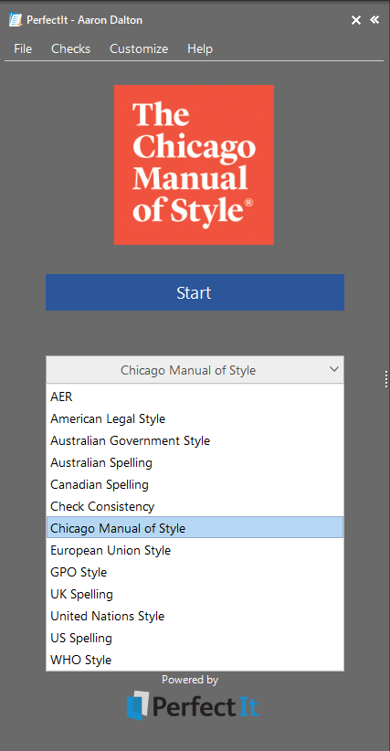
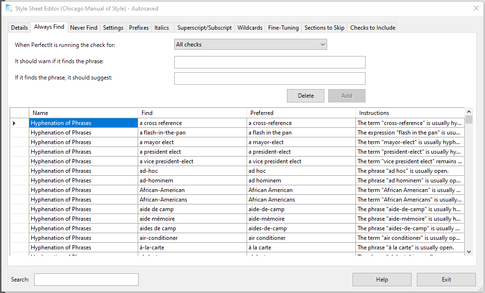

**This article was [originally published on *The Editors' Weekly*](https://blog.editors.ca/?p=9587), the official blog of the [Editors' Association of Canada](http://editors.ca).**

<!--more-->

Disclaimer: I received a free year of access to [The Chicago Manual of
Style Online](https://www.chicagomanualofstyle.org/home.html) (CMOS *Online*)
and [PerfectIt](https://intelligentediting.com/) 5 as part of testing the beta
version and writing this review.

Efficiency is key to maximizing your income. There are only so many hours in a
day, so you simply must do more in those hours. Editing software can make a huge
difference. Software isn’t to a point yet where it can supplant an editor. It
can’t tell you that one of your side characters had blue eyes on page 30 and
green on page 130. It can’t tell you that requirement 59 can be read as
contradicting requirement 8. But it is very adept at doing mechanical tasks like
compiling abbreviations and checking spelling. I have been using PerfectIt for
years and am a big fan. Intelligent Editing recently released [The Chicago
Manual of Style for
PerfectIt](https://intelligentediting.com/product/whats-new/), an update I
believe *The Editors’ Weekly* readers will want to learn about.

## What is PerfectIt?

PerfectIt is at its heart a consistency checker. It examines the totality of
your document and finds all the places where you did things differently. It also
highlights deviations from selected preferences.

PerfectIt comes with several built-in style guides (figure 1) but also gives you
complete control over its various checks. The style sheet editor (figure 2) lets
you start either with something built-in or completely from scratch.

The list of things PerfectIt checks is long and fully customizable (figure 3).
The ones that I personally rely on the most heavily are hyphenation, list
punctuation and abbreviation checks. What initially sold me on PerfectIt was how
easy it was to review and fix the inconsistencies. Figure 4 shows an example of
a hyphenation check. It shows me the different versions in the document along
with the counts. I can click on any particular instance and it will take me
directly to it so I can see it in context. From there, I can simply click the
Fix link or tweak it in the text itself.

PerfectIt will also perform finalization tasks like updating cross-references,
removing excess spaces, clearing document properties and helping produce a table
of abbreviations. Like any good software that works with human language, it
doesn’t do anything automatically. Many inconsistencies (especially hyphenation)
are not actually mistakes. But PerfectIt makes it easy to find possible issues
and exercise editorial judgment.

## What’s new

The most recent (fifth) version of PerfectIt has several background improvements
— like the style sheet editor search feature and faster checking overall — but
the most exciting new feature is its integration with *The Chicago Manual of
Style*.

When you run a check on text, the software will not only tell you what the check
found, but it will also show you specific sections of the style guide that
pertain to the issue (figure 5). The CMOS style sheet, like all the others, is
fully customizable (see figure 2 as an example of where you could customize
hyphenation).

If you have a personal or institutional subscription to CMOS, you can link it to
your PerfectIt licence. (Given the nature of this product and the collaboration
between The University of Chicago Press and Intelligent Editing, they are unable
to offer *CMOS* for PerfectIt free of charge through the Editors Canada website.
Log in to the [member services
section](https://www.editors.ca/members/services/chicago-manual-style-online) of
the association for more details about free and discounted access to *CMOS
Online* and PerfectIt.)

## How I use it

I brought PerfectIt into our workplace years ago and use it almost daily. It has
become essential. My standard workflow is to run PerfectIt before I start my
first editing pass and then again after. The first run cleans up the document so
that I’m less distracted and can focus more on reviewing the content than the
mechanics. Running it again after my first pass lets me reassess any decisions
once I’ve read the entire text and helps catch any inconsistencies my edits may
have introduced.

This workflow minimizes the number of major issues I miss because of
“[attentional blink](http://www.scholarpedia.org/article/Attentional_blink).”
I’m sure we’ve all experienced that moment of finding an error after the fact
and wondering, How did I miss that?! Often, it’s because there was another
mistake nearby, and after fixing that error, our attention “blinked” long enough
for us to miss the other error right next to it. Dealing with these mechanical
issues before diving into the text allows me to be more focused and effective in
repairing issues software will likely never be able to detect.

I recommend PerfectIt to editors all the time. I think it’s an invaluable tool.
Its design makes it easy to not only find these mechanical issues but also
quickly and painlessly fix them, allowing you to make much more effective use of
your billable hours. It even has a 14-day free trial.
