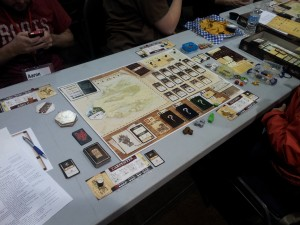
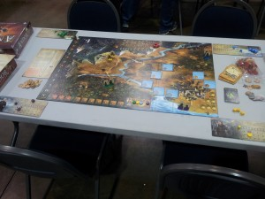
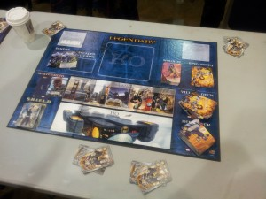
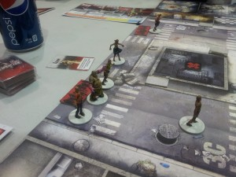
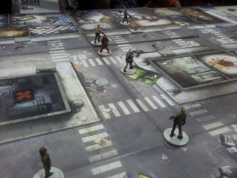
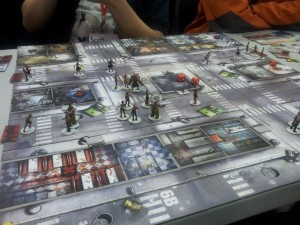
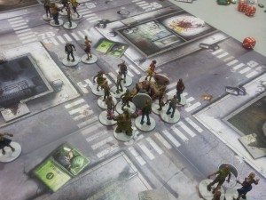
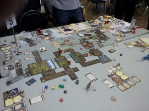

[FallCon](http://fallcon.com/) is an annual boardgaming convention that takes place in Calgary, Alberta, over three days (Friday night, all day Saturday, and Sunday morning/afternoon). This year was FallCon 26. Being the “game guy” in the family, I almost never have opportunities to play games I didn’t purchase myself. For me, this is one of the biggest draws of FallCon. Open gaming is a great way to be exposed to new games (they have a library of almost 700 games), but my preferred way is through FallCon’s hosted games. Over the three days, there are five scheduled slots in which a half-dozen or so different games is being played. When you register for the con, you can choose a particular game that you want to learn/play. That game is then taught and monitored by a FallCon volunteer (a “host”). This way you are taught by an expert and have someone right there to answer your questions. The slots are generally a few hours long, so you can usually squeeze in multiple games. I just think this is the best way to learn new games. This year I didn’t get as much open gaming in as I did last year, but every game I *did* play was brand new to me. So that was fun, even if it turned out I didn’t like the game.

A huge thank you to the FallCon committee and volunteers for making the convention possible. I look forward to it every year. And thank you to my wife and her sister Darla for giving me the time to go!

Here is the list of games I played, essentially in the order played, and my thoughts about them. I didn’t get pictures of all of them, but I think I did of all the hosted games. Never hesitate to contact me if you have specific questions about a particular game or gaming in general.

1. [Robinson Crusoe: Adventure on the Cursed Island](http://boardgamegeek.com/boardgame/121921/robinson-crusoe-adventure-on-the-cursed-island) (hosted)
2. [Legends of Andor](http://boardgamegeek.com/boardgame/127398/legends-of-andor) (hosted)
3. [Antike](http://boardgamegeek.com/boardgame/19600/antike) (open gaming)
4. [Legendary: A Marvel Deck Building Game](http://boardgamegeek.com/boardgame/129437/legendary-a-marvel-deck-building-game) (hosted)
5. [Pathfinder Adventure Card Game: Rise of the Runelords – Base Set](http://boardgamegeek.com/boardgame/133038/pathfinder-adventure-card-game-rise-of-the-runelor) (open gaming)
6. [Dungeon Roll](http://boardgamegeek.com/boardgame/138788/dungeon-roll) (open gaming)
7. [Discworld: Ankh-Morpork](http://boardgamegeek.com/boardgame/91312/discworld-ankh-morpork) (open gaming)
8. [Zombicide](http://boardgamegeek.com/boardgame/113924/zombicide) (hosted)
9. [Seasons](http://boardgamegeek.com/boardgame/108745/seasons) (open gaming)
10. [Descent: Journeys in the Dark (second edition)](http://boardgamegeek.com/boardgame/104162/descent-journeys-in-the-dark-second-edition) (hosted)

### Robinson Crusoe: Adventure on the Cursed Island

Friday night was the game I was most excited to play and the game that turned out to be my favourite game of the con: [Robinson Crusoe](http://boardgamegeek.com/boardgame/121921/robinson-crusoe-adventure-on-the-cursed-island). This is the latest cooperative hotness, and I can see why it is so popular. The theme is thick and permeates the whole game. It also comes with four completely different scenarios, which makes replaying the game even easier. The game is also really hard, but not stupid hard (see the later entry for Zombicide). You at least have hope. You feel like you really could have won if only you had done this one thing differently. At first glance it seems like the game is super complicated, but after taking a turn, it made sense very quickly. There *is* a lot of game here, though.

Our teacher for this session was Carlyn, who was super friendly and helpful. We played a four-player game and got two playthroughs in. We lost both times, but we came so, so close the first time! We got some lucky card draws early on that allowed us to carry unused food forward from turn to turn, and we would have won if we were just patient for one more turn. We used up the last of our wood to get the signal fire started two turns early. The problem was that that night we had some horrible weather that could have been mitigated if we had held on to that wood just a little longer. We all died from exposure just two nights before the rescue boat came. The second game was much, much worse. We didn’t get too far before dying.

I am so glad I preordered this game, and I can’t wait to pull it out at the next family gathering. If you want a hard co-op with manageable randomness and tons of theme, this is the one to buy. I will hold on to Pandemic just because it’s the simplest of the co-ops I have, but Defenders of the Realm and Robinson Crusoe are my go-tos for a hardy co-op group.

About to start a game of Robinson Crusoe.

### Legends of Andor

Saturday morning was a hosted session of [Legends of Andor](http://boardgamegeek.com/boardgame/127398/legends-of-andor). This is another cooperative game (all the hosted games I played this year ended up being co-op) with a heavy fantasy theme and multiple scenarios. Mike taught us this game, and we played two four-player games. We played the first two scenarios and lost them both. (We were actually creamed in the second scenario.)

Ultimately I really did not enjoy this game. The scenarios are far too scripted. Once you play a scenario a couple of times, you know what’s coming and how to best prepare for it. This limits the replayability. There’s also no character progression. You don’t get stronger as you work through the scenarios. And finally, the scenarios are just too damn hard. We came really close in the first scenario, but the second scenario wiped us off the board. Unlike Robinson Crusoe, however, I never felt hopeful that we *could* win. That second scenario seemed impossible! You have to defeat monsters to keep them from overrunning the castle, but killing a monster also progresses the game clock. And halfway through the game, you get yet another scenario objective that essentially requires everyone to be there to beat it. You want to feel harried and a little picked on in a good co-op, but this was too much. It’s no wonder I’ve yet to talk to someone who has ever beaten the sixth and final scenario. I could spend many playthroughs just trying to beat scenario two, but I just didn’t feel motivated to keep trying. It just fell flat for me.

About to start a game of Legends of Andor (scenario #1).

### Antike

In walking around the open gaming area, I was invited to play [Antike](http://boardgamegeek.com/boardgame/19600/antike). This is an older game (2005) and one I had heard of but never seen played. We played a five-player game and two people at the table knew the game and were able to teach it well.

This is a streamlined civilization-building game in which you try to expand your little civ and earn victory points. The first player to a fixed number of points wins. You can earn points by military conquest, but you also get them for being the first to unlock new technologies, expanding your empire, and building temples. I always like games where not only do you have multiple paths to victory, you actually need to use multiple paths to win at all.

The main mechanic is the rondel. For those not familiar with it, you have a circle somewhere on the playing surface that is divided into multiple slices, each with some sort of possible action on it. You have a marker that starts somewhere on the rondel and you are allowed to move a certain number of spaces in a fixed direction for free. Typically you can pay something to go further around the rondel. In this case, you can move 1 to 3 spaces clockwise for free. For every additional space, you have to pay a single resource of your choosing. Actions include things like movement, buying armies, collecting various resources, researching technologies, etc. So there’s a certain strategy in making the most efficient use of your movements around the rondel.

Each game turn goes really fast, which is rare in a civ game. I got myself kind of cornered early on and did not do well (I came in last of five players). I *did* enjoy the game, though. It’s not really for me and my collection, but I’m glad I had a chance to play it, and I would be willing to play it again if given the chance. If you like civ-building games in general, and you like the rondel mechanic in particular, this might be the game for you (though it’s hard to find now).

###  Legendary: A Marvel Deck Building Game

The next hosted game was yet another co-op—[Legendary: A Marvel Deck Building Game](http://boardgamegeek.com/boardgame/129437/legendary-a-marvel-deck-building-game). I’ve heard tons of buzz about this game and was excited to finally experience it first hand. I have not tried the other two superhero card games (the DC deck builder and Sentinels of the Multiverse) so I can’t compare them. I really want to try Sentinels, though. I *can* compare it to Dominion, which is the only other true deck builder I’ve played often.

Legendary has good flavour and has many more moving parts compared to Dominion. The players play groups of superheroes trying to defeat a given mastermind. (There are a number of different ones with different powers.) You start with a certain minimum number of cards with basic attacks and buying power. Heroes from a general hero deck are revealed on the Headquarters space. Heroes include all the basic Marvel heroes: Wolverine, Cyclops, Iron Man, etc. At each turn, villains are revealed from the general villain deck. Villains move throughout the city as new villains are revealed. If not defeated by the time they get to the end of the row, they escape. Often that triggers nothing, but sometimes something bad will happen. Different villains also have different powers/effects based on where in the city they are. Players continue to take turns and build up their deck until they can attack the mastermind. Successfully strike the mastermind enough times and he is defeated and you win! Villains you defeat go into a separate victory pile. Even though it is a co-op game, there is still an overall winner: whoever has the most victory points in their victory pile.

I like the city mechanic and I like that you get new heroes to recruit every turn, instead of drawing from a fixed number of piles. There are good synergies between different types of cards, allowing you to create some powerful chained attacks. The problem was that I just didn’t have fun! I don’t love, love deck builders in the first place, so keep that in mind. I would prefer Legendary over Dominion, but I wouldn’t play Legendary again unless in a group that really wanted to play. If you like deck builders, and you want something more dynamic than Dominion, take a look at Legendary.

About to start a game of Marvel Legendary.

### Pathfinder Adventure Card Game

The [Pathfinder Adventure Card Game](http://boardgamegeek.com/boardgame/133038/pathfinder-adventure-card-game-rise-of-the-runelor) was released in GenCon of this year and received huge buzz, so I picked it up from the library as soon as I had the time. Fortunately a few others also wanted to play. None of us had played before, though, so they were very patient as I worked through the rulebook.

The original Pathfinder is a standard pencil & paper RPG system. The mythos and core mechanics were then boiled down and streamlined into a card game. Though I’ve never played the Pathfinder RPG, I have played my share of other RPGs, and I was very impressed with the Pathfinder card game. There are lots of different characters to choose from and the character deck system is very flexible. It is nice to be able to customize your deck if you choose. The game has a full-fledged campaign system built in that allows you to level up your characters over various plays. There’s also no dungeon master or overlord, so everyone gets to participate. Each scenario comprises different locations, each with its own customized deck. Players explore the various areas searching for the scenario objective (usually a boss of some sort). The combat system is straightforward but flexible enough, and I found that I had a really good time. I can see how leveling up over time would be lots of fun. The only problem is that I’m not sure my family group would be interested. I’m keeping this on my to-buy list, but it will have to live further down for a time.

### Dungeon Roll

I had a little more time after Pathfinder before the next hosted game, so I pulled out [Dungeon Roll](http://boardgamegeek.com/boardgame/138788/dungeon-roll), a little press-your-luck dice game that has received a fair bit of good buzz. I just read the rules myself and played a solo game to get a taste of the game. As far as press-your-luck dice games go, this is by far the most flavourful and thematic. I really enjoyed it and it has moved up my to-buy list.

Each player receives a character card with some special power or other. You then roll the party dice, which show various faces: fighter, mage, cleric, thief, guardian, and scroll. This determines your resources as you delve into the dungeon. The person to your left then rolls the dungeon dice, one for each level of the dungeon you’ve reached. The dungeon dice also show different faces: ooze, skeleton, goblin, treasure chest, potion, and the dragon. Each of the hero types can destroy *all* of a given monster type, but any hero type can destroy any *one* monster, regardless of type. Treasure chests can be opened by thieves and give you a random treasure with some special power or other. Scrolls let you reroll dice, and potions let you take dice back out of the graveyard (where they go when they defeat a monster). Dragon dice build up in the dungeon until there are three or more, at which point you must defeat the dragon or run.

Whenever you start a dungeon level, you have to finish it, or else you are forced to leave empty handed. If you defeat a level, you can push your luck and continue deeper or you can leave, collecting experience points for each level you completed. Everyone gets three delves and whoever has the most XP at the end wins.

I think this is the best push-your-luck game I’ve played. With this, I’m not sure I’d need any other, though Zilch is super easy to play with just straight dice, too.

### Discworld: Ankh-Morpork

While browsing the game library, a gentleman came up and asked if I wanted to join them in a game of [Discworld: Ankh-Morpork](http://boardgamegeek.com/boardgame/91312/discworld-ankh-morpork), based on the Terry Pratchett novels. I’ve never read the novels, believe it or not. Having heard of the game in passing, I agreed to give it a go.

It’s set in the city-state of Ankh-Morpork. It is divided into numerous sections, each with a special power for the player who controls it. Players place minions and under certain circumstances can build a house in a district, giving that player access to that district’s special power. Players play various cards built on the Discworld mythos that let you perform various actions (buy minions, build a house, kill minions, steal money, etc.). The issue is winning. At the beginning of the game, each player receives a character with a unique victory condition. Once met, you win the game.

I personally didn’t love the victory conditions. It made me feel somewhat aimless as I was playing. I knew what I was trying to accomplish, but often to do so I also helped another character. Deduction is a big part of the game, trying to ascertain what victory conditions the others are going for and stopping them. The game worked well and felt solid, but it wasn’t to my liking. I would be willing to play it again, but it’s not one I will buy.

### Zombicide

The last hosted game of Saturday night was [Zombicide](http://boardgamegeek.com/boardgame/113924/zombicide). This is another co-op game that I had heard a lot about but had never played. This was one of first boardgames to really succeed on Kickstarter.

In this game you each get a character with various powers and you must fulfill the scenario objectives while trying to stay alive. Zombies attack you from all sides. The theme is lots of fun, and the figures are pretty awesome. Again, I found this game to be far, far too hard. At no point did I ever feel like we had a chance. It was just an exercise in delaying death…brutal, bloody death. I really prefer to feel some glimmer of hope. The worst rule is how zombies spawn in a building as soon as you open a door. We were just so swarmed we had no hope. I snuck around behind to get some mission objectives while the others drew the zombies by making noise, but once flattened, I had no hope. So in short, fun theme, and fun moments, but ultimately impossible to actually win.

A fatty and his entourage makes an appearance.

Amy (my character) prepares to cleave a zombie in half with her katana.

Ned (centre) is bravely drawing fire, but I don’t think he’s going to make it.

Indeed, Ned falls bravely (or was it foolhardiness)?

### Seasons

I only had about 45 minutes before my last hosted session, but I saw a couple playing [Seasons](http://boardgamegeek.com/boardgame/108745/seasons) and they were looking for a player and were willing to let me leave partway through. We got to play through an entire year before I had to go. None of us had played before, so it was a good learning game and then they were able to do a full two-player game after I left.

In Seasons you are each wizards. As the seasons change, different powers come available. You gather energy tokens and crystals through various means and bring into play different power cards to help yourself and hurt your enemies. After three years, whoever has the most prestige wins.

I only played a few turns, but I was pleasantly surprised. The cards are whimsical and the strategy relatively deep for a card game. This has gone on my to-buy list. I think it will work well.

### Descent: Journeys in the Dark (Second Edition)

[Descent: Journeys in the Dark (second edition)](http://boardgamegeek.com/boardgame/104162/descent-journeys-in-the-dark-second-edition) is one of those games that has been around for a long time but I’ve just never had a chance to play. It is a classic dungeon delve where one player plays the overlord and controls the monsters. The others are heroes with lots of different equipment and powers and try to accomplish the scenario objectives. Like Pathfinder the card game, both the heroes and the overlord level up and improve as you work through the campaigns. The game takes a little time (at least 2 hours, if not 3), but it was lots of fun. It’s somewhat unbalanced in the heroes favour. I didn’t have a chance as the overlord, but I still had a great time.

The problem is that because the game has been around for so long, if you want all the figures and all the campaigns, you have to buy all the first edition stuff as well as the new second edition stuff. Not a cheap feat. I might consider just buying the second edition base set and seeing if my group would be interested, but it’s still quite an expense for a trial. I’ll keep it on my radar, but it won’t be on my purchase list any time soon.

If you like dungeon delves, I don’t think you can get much better. The people I played with clearly preferred it over Rune Wars and Rune Bound. I liked the mechanics overall and the available customization. Great game, but just not for my group.

A game in progress.
