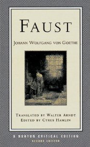

Johann Wolfgang von Goethe, *Faust: A Tragedy*, trans. Walter Arndt, ed. Cyrus Hamlin, 2nd edition (NewYork: W. W. Norton & Company, 2001).

Goethe’s *Faust* has been on my reading list for a long time. I finally got through it, and it was nothing like I expected. My exposure to *Faust* has been through music and music history. I know of the scene “Gretchen am Spinnrade” because of Schubert’s setting of it. I have encountered the character of Faust and the purported meanings of the play through a multitude of readings on various aspects of music history. I never found the time to engage the original itself, though.

The play consists of two parts. The first was finished in 1808, and is the story I expected. The second part wasn’t finished until the year Goethe died in 1832 and was published posthumously. It’s in this part that things took multiple completely unexpected narrative turns until the final act returned to what seemed to me to be the main narrative thread (though with a non-traditional ending). You’ll note there is no rating. Literary works like this require more than a single read through before forming judgments. I found the second part confusing and at times difficult to slog through. This Norton critical edition helped a great deal, explicating some of the twists and turns and offering insights into how they can be understood. What I didn’t discover until after I had finished reading it was that the play was originally intended as a “closet drama”—one not intended for the stage but for solitary reading. As I read scenes with griffins, sphinxes, giant ants (yes, you read that right), and even a scene where a mountain is birthed from the stage, I couldn’t help wondering how on earth this would be presented on stage. Apparently it has been produced, but I’m not sure if those performances included the crazier scenes of the second part.

Like any work of literature, it places significant demands on the reader. Modern readers will particularly struggle, being so unfamiliar with the sources of the ubiquitous allusions. I’m simply not in a position to offer any real judgment on its literary merit. I certainly enjoyed most of the read, and I’m glad I finally tackled it, but it will take time and study beyond my current resources to really understand it. This particular edition includes a number of essays at the back that provide some fascinating critical views on the play. I won’t even attempt a synopsis here. There’s far too much going on. [Google will provide you with the overview.](http://www.google.ca/search?q=goethe+faust+synopsis)

In light of all my Wendell Berry reading of late, a particular exchange jumped out at me. It occurs between Faust and Mephistopheles shortly after the bargain has been struck. It is the scene “Witch’s Kitchen” in which Mephistopheles takes Faust to visit a witch for a potion to make him younger. Once there, he begins to have second thoughts. Here are the opening lines (2337–2365):

> **Faust**. I find this magic-mongery abhorrent; 
> And I am to be cured, you warrant, 
> In this hotchpotch of lunacy? 
> Do I seek counsel from some skirted quack? 
> Will this absurd swill-cookery 
> Charm thirty winters off my back? 
> If that’s your best, then woe is me! 
> My hopes already seem confounded. 
> Might there not be some balm, some remedy 
> By nature or a noble mind compounded? 
>
> **Mephistopheles**. The know-it-all, as always! Look— 
> True, nature’s way to youth is apter; 
> However, that comes in a different book, and it’s a curious chapter. 
>
> **Faust**. I want to know it. 
>
> **Mephistopheles**. Very well; it comes your way 
> Without physician, gold, or magic-rigging: 
> Go out into the fields, today, Fall to a hoeing, digging, 
> Contain yourself, your mind and mood, 
> within the narrowest of spheres, 
> Subsist on uncommingled food, 
> Live as a beast with beasts and spurn not chores unsung, 
> In person spread your crop-fields with manure; 
> This is the best resource, you may be sure, 
> Through eighty years to stay forever young! 
>
> **Faust**. I am not used to that, to goes against my marrow 
> To put my hand to hoe or harrow. 
> A narrow life would suit me not at all. 
>
> **Mephisotpheles**. So back to witching after all. 

Two primary themes jump out at me. First, the whole idea of the “quick fix” and how we’re often willing to do, sacrifice, or risk just about anything for instant gratification. Second is this persistent and mistaken equating of narrowness with shallowness, and breadth with depth. I simply don’t buy it. I think it comes down to what your narrow focus is. While, like Faust, I don’t feel I could just go out and be a farmer tomorrow, I think the essence of the agrarian life can still be retained even in the city. A focus on nature, family, and community; a focus on activities that bring one joy; an acknowledgment that we are but a part of a much larger whole, these are things that really can be pursued even in an urban setting. Certainly it is more difficult given the industrial economy we find ourselves in, but I really think it is possible to be “in the world but not of the world.” This is obviously something Faust flatly rejects, instead pursuing lust, knowledge, and power at the expense of any sort of profound connection or relationship.

So, in summary, if you have the literary will, I recommend engaging with this classic work. At the very least, do some cursory readings on the Dr. Faustus legend, it’s multiple retellings, and Goethe’s version of it. You won’t regret it.
