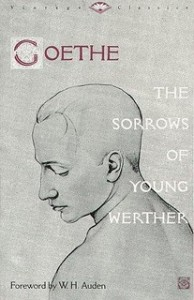

Johann Wolfgang von Goethe, *The Sorrows of Young Werther* (New York: Vintage Classics, 1990).

[*Die Leiden des jungen Werthers* [*The Sorrows of Young Werther*]](http://en.wikipedia.org/wiki/The_Sorrows_of_Young_Werther "Wikipedia article") was published in 1774 and is a quintessential example of early Romanticism and the *[Sturm und Drang](http://en.wikipedia.org/wiki/Sturm_und_Drang "Wikipedia article")* movement. It’s what is called an “epistolary novel”: a novel composed of a series of documents, usually letters. In this case most of the letters are to Werther’s friend Wilhelm as he describes his wanderings and eventual fateful meeting of Lotte. There are a few letters to Lotte and others. Goethe wrote it when he was 24 and it is what made him famous. Goethe had to be one of the most sought-after and visited artistic personages. During his later years, in Weimar, he was visited constantly by people famous and mundane. Many of these people had only read this one of his books. The foreword of this particular edition quotes a few telling lines of Goethe’s Second Roman Elegy.

> Ask whom you will, I am safe from you now, you fair ladies and fine society gentlemen! “But did Werther really live? Did it all really happen like that? Which town has the right to boast of the lovely Lotte as its citizen?” Oh, how often I have cursed those foolish pages of mine which made my youthful sufferings public property! If Werther had been my brother and I had killed him, I could scarcely have been so persecuted by his avenging sorrowful ghost.

The book is less than 170 pages long and can be read in only a few hours. I think this is something everybody should read at some point. This particular translation is beautifully done, the emotions are vivid, and the characterizations are powerful.
