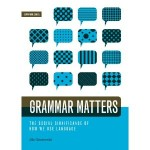

**Rating:** 3/5

Jila Ghomeshi, *Grammar Matters: The Social Significance of How We Use Language* (Winnipeg, MB: Arbeiter Ring Publishing, 2010).

This book was mentioned by a colleague in the latest edition of the EAC magazine *[Active Voice](http://www.editors.ca/resources/eac_publications/newsletters/index.html "EAC's Active Voice")*. I immediately checked it out from the library. Unfortunately I have to say I was underwhelmed. It’s a small book (only 100 pages, 4.25 x 5.5 inches), and she really only needed a couple of pages to make her point. Her point—one nobody in their right mind would argue with—is that one should not judge others by their use of language. Language is fluid and living, and just because somebody says “workin'” instead of “working” does not mean they are lazy or poorly educated. She then extends this to say that when “prescriptivists” lambaste a particular use (or mis-use) of language, what they are really doing is expressing prejudice. This is where I began feeling uneasy. Why? Because apparently, I am a prescriptivist.

The first problem is that she never qualifies the terms “descriptivist” and “prescriptivist.” The reality is that there is a continuum between the two. Most people are not purely one or the other. Part of my discomfort comes from the fact that I am a professional prescriptivist. As an editor, I am paid to scrutinize text not just for blatant errors but for infelicitous usage. I enforce consistency, and in my current job that involves the application of an arbitrary style sheet. The fact that mis-placed or missing apostrophes actually jump out at me is a marketable quality! At the personal level, I am also closer to the prescriptivist end of the continuum. I learned two human languages later in life and have absorbed a dozen computer languages since I was old enough to type—processes that require being very sensitive to rules and “proper” usage. I agree that change is good, and many recent changes to the language are very useful. (I have no problem with “they” as a gender-neutral, singular pronoun, for example.) That does not mean that a “standard” language is not useful or worthy of preserving (or that it, too, can’t change over time).

The meat of the book is a debunking of “the fallacies of prescriptivism”: logic, precision, and authority. This where things really fall down, in my view. All she does is throw out a bunch of straw men. Nobody I know of has argued that the English language is truly logical. We all know our spelling is insane, particles like “up” are used in the weirdest ways, and our irregular verbs make no sense. But to then say that the phrase “I could care less” should be simply accepted because its use is widespread is lunacy. This is not a case of irony or poetic usage. It’s quite simply wrong.

The precision section is a little more reasonable, but I’m still not sure who she’s arguing with.

> Precision, like many other concepts, can only be assessed in terms of how accurately a message has been conveyed, not in terms of the form the message has taken. When someone declares another person’s language to be unclear and imprecise, what is implicit is that it is unclear and imprecise *to them*. Such statements obscure the shared responsibility we have for achieving understanding.

But how is understanding to be achieved, then? If your goal is to communicate ideas to people outside of your immediate linguistic circle, then there needs to be some sort of standard that we can all (for the most part) agree on. This is one of my primary jobs as an editor is to ensure that the text is appropriate for its target audience. To simply say prescriptivism is bad is to throw the baby out with the bath water.

The authority section basically affirms that it is a language’s speakers that determine the validity of of the language. Unlike the French, we don’t have a central academy that monitors and prescribes usage. This is great and all, but when the pencil hits the paper, is the possessive of Moses “Moses'” or “Moses’s?” Editors feel sometimes like they are on the front lines of the language battle. The linguists (like Ghomeshi) are theorists. It’s all nice to say that language is defined by its users and precision is an illusion, but the editors need to actually make a concrete call and commit something to print. Authority is the cornerstone of our work. Now, more often than not we accept the author’s authority. If an author consistently uses a particular style or insists on a turn of phrase that perhaps I personally don’t understand or agree with, so be it. I’m not Joan of Arc. But when inconsistency arises, what is the editor to do but turn to some authority or other?

She ends with the following:

> If we shift our way of thinking about language away from prescriptivist views, we may liberate ourselves in the process. … Prescriptive notions of “correct” language and the “laziness” of people who don’t use it can evoke feelings of insecurity or embarrassment that prevent us from acknowledging our difficulty with an unfamiliar style of language and seeking a translation. The clarity that prescriptivists seek to preserve in language is in fact something that must be constantly negotiated as language shifts and turns. We must engage in these debates about language confidently rather than with a sense of shame. Ultimately, letting go of prescriptivism will permit us to truly enjoy a far greater range of expression than the narrow channel we think of as “correct.”

Poppycock. The maintaining of a “standard English” is what allows true expression—expression that can be understood by more than just you and your immediate circle. Without a degree of prescriptivism, you end up at the Tower of Babel.

Now, to be fair, she does have a chapter near the end called “In Defence of a Standard” in which she says:

> Arguments against prescriptivism are not to be conflated with arguments against having a standard, or common, form of a given language. The arguments against prescriptivism are arguments against considering one form of language to be inherently better than another. It is good to have a standard, but the standard is not “good.”

At this point my confusion reached its peak. Who is intended audience for this book? I guess I’m not convinced there really are that many “pure” prescriptivists out there. Sure there are the Internet trolls, and Lynne Truss *can* get a little carried away sometimes, but I think most people (certainly the editors I kibitz with) strike a perfectly healthy balance between descriptivism and prescriptivism. If her argument really is just that all forms of language should be accepted at some level, then why the 100 pages? It seems like overkill (perhaps like this post).

I think ultimately Ghomeshi misses the mark. If the debate interests you, go ahead and read the book, but I don’t actively recommend it.
