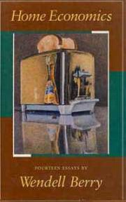

**Rating:** 5/5

Wendell Berry, *Home Economics: Fourteen Essays by Wendell Berry* (San Francisco: North Point Press, 1987).

One thing I love about editing is the opportunity to read so many different types of texts I would never normally pick up. Sometimes, even if the book I’m editing is not particularly interesting, I almost always find at least one book or author cited that catches my attention. [The Solnit book I previously posted about](../wanderlust-by-rebecca-solnit) and this collection both came from my current project.

Published in 1987, this collection of essays is still very timely and applicable. Berry is an eloquent writer and gave voice to many feelings I’ve had for a long time. I loved reading them! His essays centre mainly around agriculture and focus on the modern “industrial economy” and its deleterious effects on home, family, and community. (If you have any farming background, there are two essays specifically about farming you might find of particular interest.) I wish I could say I was optimistic as he is about the feasibility of change. I’m more apocalyptic, I guess. I do hope, though, for a better world. I’m just not convinced we can do it on our own. This collection also contains a fantastic essay on “The Loss of the University.” The collection makes for fast reading (not even 200 pages), and I recommend it to everybody.
