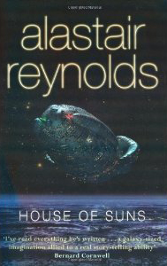

**Rating:** 4/5

Alastair Reynolds, *House of Suns* (Gollancz, 2009).

I just finished the book *House of Suns* by Alastair Reynolds over the weekend. If you enjoy sci-fi, then I heartily recommend this book. I thoroughly enjoyed it and found I just could not put it down. It’s a mildly dense read (I dunno, 12 hours if you went straight through?) and it is not for children. There is coarse language and sexual subject matter. I have put down not a few books because of gratuitous whatever, but the language here is infrequent and 99% of the time relevant. The innuendo is is also infrequent and on the whole, quite mild. Just FYI.

The fundamental conceit is that of cloning. A group of wealthy individuals made 1000 “clones” of themselves (I put it in quotes because they’re not exact physiological clones, but they share the same mental makeup and memory set) and sent them out in to the universe. They become known individually as “Lines” (Gentian Line, Marcellin Line, etc…) and the Lines together are called the Commonality. Because of some very interesting time-bending technology, they have been alive for millions of years.

The story itself, though, is a standard (but not tired) tale of love, betrayal, and intrigue. To be honest, I didn’t personally love the way it ended. There were a few ends that were a little too loose for my liking. That said, I still think it is a perfectly defensible ending, and it didn’t sour me at all. Even if you’re not a huge sci-fi fan, I think this book will still appeal to you. The technology is of course ubiquitous, but it is not (in my opinion) intrusive or gratuitous. Everything works well together. This was my first Alastair Reynolds book, but it won’t be my last. I look forward to seeing what else this author has to say.
