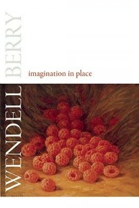

**Rating:** 5/5

Wendell Berry, *Imagination in Place* (Berkeley, CA: Counterpoint Press, 2010).

I have read a fair bit of Wendell Berry lately, and I will soon be looking more closely at his fiction. This collection of essays is more autobiographical and is certainly more literary. The overall focus is on influence—how we are influenced by our place and by who we know and what we read. He suggests (p. 42):

> We speak naturally, and I think accurately, of a “web of influence,” but it is perhaps useful to change the metaphor by thinking of this influence literally as a flow: a steadily augmenting flow of consciousness and of conscience moving toward our country, the American land itself. One enters into this flow by way of a “moment” (a *momentum*) of clarity instinct with the power to gather other such moments.

The majority of the essays focus on the works of men and women he knew and who influenced his writing (Wallace Stegner, Hayden Carruth, James Still, and others). Much of it is about poetry. He has a lengthy and very insightful piece examining Shakespeare’s *As You Like It* and *King Lear* (“The Uses of Adversity”, pp. 141–178). He also includes a powerful essay about the American Civil War. The final essay (“God, Science, and Imagination”) is a response to Steven Weinberg’s essay “Without God” from *The New York Review of Books* for September 25, 2008. It is an eloquent and “centrist” profession of faith that tries to demonstrate the rational middle ground between scientific and religious fundamentalists.

The essay “A Master Language” touched me deeply. Not so much because of what Berry said explicitly, but because of the fond memories it evoked. It discusses the work of James Still, who wrote in a specific Kentucky dialect. Berry addresses the concept of prejudice against agrarianism (in this and in most of his essays) and of the condescension of  provincialism toward parochialism. One of the things I love about writing is how it can in most ways “level the playing field.” Physical appearance and spoken accent are essentially removed, freeing oneself from the unfortunate and often unconscious prejudgments that they can bring.

In the early 90s, I had the privilege of serving a mission for [my church](http://lds.org) for two years in Québec, Canada. For the last few months, I had the great pleasure of serving alongside one Darrell Estes of Louisville, Kentucky. He was lively, affable, and one of the funniest men I have ever met. He spoke English with a thick southern accent, but he studied French Literature at the Sorbonne in Paris. He spoke meticulous French with a pure native accent. Part of his comedic appeal was the powerful dichotomy generated as he flipped effortlessly between the two languages, telling his stories. He introduced me to the youthful and powerful poetry of Québec’s [Emille Nelligan](http://en.wikipedia.org/wiki/%C3%89mile_Nelligan) and taught me many other things besides. We became close friends, and it is a great regret of mine that we have managed to lose contact. Perhaps the most lasting lesson I learned from my friendship with him (and it may be cliché, but it appears we have not yet learned it as a culture) is that you truly cannot judge a book by its cover. We all have conscious and unconscious assumptions formed by the people we know and the media we consume. My experience with Darrell taught me to be very self-aware and to challenge those assumptions whenever they arise.

Anyway, moving from that perhaps-too-personal aside, I’ll close with a quote from the collection’s titular essay regarding “simplicity” (p. 12):

> When I am called, as to my astonishment I sometimes am, a devotee of “simplicity” (since I live supposedly as a “simple farmer”), I am obliged to reply that I gave up the simple life when I left New York City in 1964 and came here [Kentucky]. In New York, I lived as a passive consumer, supplying nearly all my needs by purchase, whereas here I supply many of my needs from this place by my work (and pleasure) and am responsible besides for the care of the place.
>
> My point is that when one passes from any abstract order, whether that of the consumer economy or Ransom’s “Statement of Principles” or a brochure from the Extension Service, to the daily life and work of one’s own farm, one passes from a relative simplicity into a complexity that is irreducible except by disaster and ultimately is incomprehensible. It is the complexity of the life of a place uncompromisingly itself, which is at the same time the life of the world, of all Creation. One meets not only the weather and the wildness of the world, but also the limitations of one’s knowledge, intelligence, character, and bodily strength. To do this, of course, is to accept the place as an influence.

I heartily recommend Berry’s writings to anybody and everybody.
