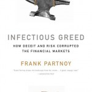

**Rating:** 4/5

Frank Partnoy, *Infectious Greed: How Deceit and Risk Corrupted the Financial Markets* (Revised ed.) (New York: Public Affairs, 2009).

Make no mistake, this is one daunting read. It is 450 pages of small print and excruciating detail, and the content is enough to make you just go mad with frustration. This book is a financial history. Partnoy’s point is that the financial meltdown of 2008 did not come out of nowhere. It was downright predictable. His goal is to outline the inception, incubation, and full-blown infection that began in the 1980s and led inevitably to the 2008 sub-prime mortgage catastrophe. He not only does an excellent job of explaining in layman’s terms what things like derivatives and collateralized mortgage obligations actually are, he goes into minute detail as he describes the people and organizations involved.

I have to say, this book got me so angry—the greed, the selfishness, the absolute lack of empathy for other human beings! Individual investors don’t have a chance! From Bankers Trust to Enron, the stories will shock you. The world has truly gone insane.

This book is not for the casual reader, but if you are interested in how we got to where we are today, then you will want to tackle it.
