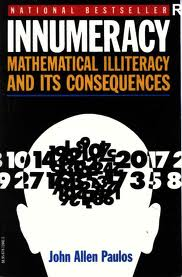

**Rating:** 3/5

John Allen Paulos, *Innumeracy: Mathematical Illiteracy and its Consequences* (New York: Hill and Wang, 1988).

Numeracy (critical thinking in general, really) is a topic I read about fairly often (e.g., [here](../panic-virus-by-seth-mnookin "“Panic Virus” by Seth Mnookin"), [here](../metamagical-themas-by-douglas-hofstadter "“Metamagical Themas” by Douglas Hofstadter"), [here](../bad-science-by-ben-goldacre "“Bad Science” by Ben Goldacre"), [here](../remembering-our-childhood-by-karl-sabbagh "“Remembering Our Childhood” by Karl Sabbagh"), [here](../being-wrong-by-kathryn-schulz "“Being Wrong” by Kathryn Schulz"), and [here](../the-unfinished-game-by-keith-devlin "“The Unfinished Game” by Keith Devlin"), plus others that never made it to the blog). Certainly not because I think I am somehow super numerate. Far from it. It is something I’m aware of, though, and one reason I’m drawn to these books is a desire to improve in this area. This is an older book (1988) that covers much of the same material I’ve read before. Paulos advocates passionately for fundamental overhauls to the ([broken](../the-death-and-life-of-the-great-american-school-system-by-diane-ravitch "“The Death and Life of the Great American School System” by Diane Ravitch")) education system that would result in an intertwining of the skills of numeracy and logical thinking into all areas of education. I agree that it’s a real problem that has real-world (negative) consequences. There are other, more engaging treatises on the subject (see the above set of links for a sampling), but this book is still worth a read if you’ve never read anything on the subject before. Important stuff.
