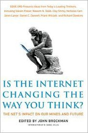

**Rating:** 3/5

John Brockman (ed.), *Is the Internet Changing the Way You Think?: The Net’s Impact on Our Minds and Future* (New York: Harper Perennial, 2011).

[Edge.org](http://edge.org) is a sort of think tank, and every year, John Brockman comes up with a question to ask “over 150 of the smartest people in the world.” This year’s question is the title of the book. Some of the other questions look interesting, but after slogging through this 450-page book, I’m not sure I’ll tackle them any time soon. The problem is each of the 150+ respondents only get a couple of pages, on average, and their responses quickly get repetitive or tiring. Some of them were very interesting, but on the whole… Part of the problem is in the selection of the respondents. The vast majority of them were academics, and I’m sorry, their experiences are not representative of the word at large. There were no religious points of view and only a handful of artists (who on the whole responded in trite, self-conscious ways). I guess I can’t say much more without revealing part of my answer to the question.

I simply don’t find credible the breathless optimism of some who don’t seem to take into account fundamental human nature, which hasn’t really changed all that much over recorded history. Anybody who believes the Internet will of itself eliminate greed, selfishness, and war is beyond naive. And anybody who thinks our economy will change such that I will ever feel comfortable with some made-in-China laser projector being installed in my glasses that will burn images directly on my retina is smoking some heavy doobage. Sure, anything is possible, and given enough time, anything even becomes probable, but it seems to me the Utopian future some predict is so far off that it’s not worth even talking about.

I am also getting tired of the prediction of the book’s demise. I simply cannot conceive of a time in the foreseeable future in which the book will not have value. The publishing industry will of necessity have to make some dramatic changes, but reading a book is an entirely different experience than reading/researching online. Material written for the web gets shorter every day. (Really, what can you possibly say in 140 characters that anybody needs to hear?) Books remain the one place where you can actually get an extended, cohesive, sustained argument without online distractions and hyperlinks. Obviously the WWW is an invaluable tool, and it has made many intellectual tasks infinitely easier and faster, but it is simply not designed for sustained focus. In fact, that is one of the skills our schools really need to teach children: focus and critical thinking (AKA “crap detection”). Those who can discipline themselves and focus on the task at hand will benefit from the Internet more than those who can’t. Critical thinking skills are more essential than ever (and apparently lacking more than ever too).

Anyway, as I’m typing this I’m realizing that perhaps I am just an old fogey, but I am finding myself more and more resistant to the incessant noise and hustle of life today, which includes the self-focused and virtual-focused social Net. There is nothing I enjoy (and miss) more than spending face time with friends. (I’m looking forward with great anticipation getting together with some school friends this weekend, in fact.) It’s one of the reasons I love board games so much. I fear, as I watch my nieces and nephews grow up, that this generation is losing sight of the real world, and I don’t see much good coming from that.

Back to the book at hand, I don’t recommend going out and buying the book. If you’re interested, check it out at your local library. Like the WWW, just scan and skim and find the parts that interest you. There’s no through-line here. The best part of the book is that each response starts with a brief bio that also lists their latest book. I culled a good dozen to add to my to-read list.

P.S. Further on the demise of the book, the reading of digital media requires electricity. It requires equipment. It requires software. It requires a medium (CD, hard drive, flash card), which has a finite (and unpredictable) lifespan. It is very easy to say *now* that we will always have access to what appears to be ubiquitous and infinite. The reality is, though, that “crap happens.” The written word (codex, scroll, whatever) is still the most durable and accessible device for the preservation of knowledge we’ve ever devised. A mile underground, out in space, in the middle of the desert, or in the city when the major power grids have gone out, a human can instantly pick up a book and access it (even if they don’t understand the language).
