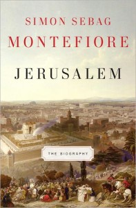

**Rating:** 4/5

Simon Sebag Montefiore, *Jerusalem: The Biography* (New York: Alfred A. Knopf, 2011).

This is one serious piece of work! This 650-page tome presents an excellent high-level summary of the history behind the conflicts we are seeing today in the Middle East. It does what a good history book should do: that is, go beyond just presenting a sequence of events and instead present a cohesive and meaningful narrative. The subtitle is “The Biography” because the book examines the people and families integral to the history of Jerusalem. Starting from King David and going all the way through to  Netanyahu in 2010, Montefiore covers a lot of ground. I have to say, it’s a depressing read—rebellion, violence, murder, war, destruction. It’s sobering stuff. This is not light reading, and you have to keep in mind the summary nature of the text. Almost every paragraph could be easily expanded to the length of a journal article, and some to the length of a book. The narrative moves quite quickly, so it may be best tackle the book in smaller chunks than I did. It’s a very pertinent book and I have to say I enjoyed it. I think it’s a great “introduction” to the full history of the current Middle East situation and I recommend it to anyone so interested.
