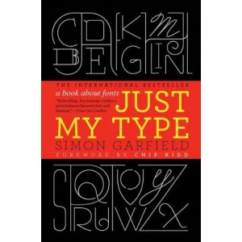

**Rating:** 1/5

Simon Garfield, *Just My Type: A Book About Fonts* (New York: Gotham Books, 2011).

Well I don’t know what I was expecting, but apparently it was more than I got. I ended up skimming through the book in an hour or so. Nothing really jumped out at me. There’s some biographical information on the various font designers, and there was some information on the origins of some fonts, but nothing really grabbed me as new or engaging. It’s probably more me than the book. If I ever revisit it, I’ll update my rating accordingly. As it stands, unless you’ve never read another book on fonts or typesetting, go ahead and skip this one.
