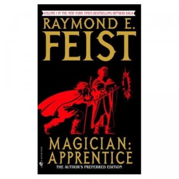

**Rating:** 1/5

 Raymond E. Feist, *Magician: Apprentice*, The author’s preferred edition (New York: Bantam, 2004).

This book was profoundly disappointing. I finished it simply because I had started it, and I will not be reading the second installment, *Magician: Master*. To be fair, this was Feist’s first foray into novel writing (or so he admits in his foreword to this new edition), but why it continues to be published decades later and why all the lavish praise heaped upon it is a mystery to me.

Fundamentally the book is a tired and clichéd *bildungsroman* (coming-of-age story) of the most superficial sort. At the character level, it falls flat at every turn. I knew I was in trouble when I read the second sentence and realized the protagonist of the story was named Pug. Yes, Pug. The story follows principally Pug and his best friend Tomas, though Pug’s “rival” Roland and princess Carline also figure strongly in this first book. Pug becomes an apprentice to the court magician and Tomas becomes a soldier. War breaks out as people from another world invade the kingdom (thus the series title “Riftwar Saga”). At the end of the first book the war has been raging for three years and suddenly the invaders pull back. For the first time the narrator gives us true access to the invaders’ minds and we see a great political schism occurring among them. This suggests that the second book will spend more time exploring their story. I doubt I will ever know for sure, as I can’t ever see myself making time to revisit the series.

One of the major problems of the book is its handling of time. Feist skips ahead years at a time even as he jumps around geographically, creating confusion and a sense of disjointedness. He never uses calendar dates and rarely announces character ages, even those of the main characters. Unless you are sitting with pen and paper at hand and keep track of the occasional and usually buried “two years later” type remarks, you will find yourself hopelessly lost as to the chronology of the story. It’s OK to cover long periods of time in your narrative, but you absolutely must give the reader signposts and landmarks along the way. I honestly cannot tell you how old any of the main characters are by the end of the first book. That is inexcusable.

Another major issue I have with the book is its handling of magic (one of the hallmarks of the fantasy genre). Magic and the supernatural are literary subjects most easily treated in the fantasy genre (as opposed to science fiction, for example). One of the reasons I enjoy this genre is the exploration of these subjects. I like to see the different ways they are rationalized, systematized, and practiced. What I expect is that the author will provide some rational framework for how magic fits in their world, if at all. Tolkien completely spiritualizes it. [Weiss and Hickman’s “Death Gate Cycle”](../the-death-gate-cycle-by-margaret-weis-tracy-hickman "The Death Gate Cycle by Margaret Weis & Tracy Hickman") systematizes it quite extensively. Robert Jordan explores the theme of the differences between the sexes. Ursula Le Guin’s “Earthsea” books explore the power of names. Patricia McKillip’s “Riddlemaster of Hed” trilogy explores man’s connection to the land, and David Eddings focuses on “the will and the word.” I could go on, but this illustrates the diversity of approaches one can take to the topic. Feist sidesteps the question entirely. He paints magicians somewhat as bumblers, blindly seeking to control powers they apparently do not understand. He hints that magicians are different from priests (they can do different things), but he never moves an inch further than that. There is no discussion of spirituality or theology anywhere. (I’m not saying such a discussion must exist, but if you’re going to have priests and the occasional curse or oath thrown around, you owe it to the reader to at least provide a basic framework and context.) For a book whose title is *Magician*, I was sorely disappointed by his complete failure to address this subject.

Finally we come to my main issue with the story and its characters: its complete lack of depth. It is superficial in every way. Every Romanticized stereotype of boyhood and young manhood is unleashed: unconditional camaraderie, sexual awakenings, rivalry for a woman’s affections, the reconciliation of such rivalries through physical conflict followed by the consumption of alcohol, the list goes on. But not one of these is treated with any depth or sense of reality. He presents the stereotype and then immediately moves on. For a *bildungsroman*, the characters remain remarkably static. We are *told*, for example, at the end of the book, that Carline has grown up and moved from being the petulant girl we spent a good deal of time with at the beginning of the book to being a strong and insightful young woman. Well when it comes to character development, the composition principle of “show, don’t tell” is most applicable. Pug makes almost no forward progress at all. We see no development in his powers, he takes only the most minimal part in the action, there is no hint whatsoever that Pug will ever become the titular master magician of the second book. Again, the books are supposedly about him! Tomas changes somewhat, but his development story is completely spoiled (in my view) as the change is being caused from an external source, not from within. (While we’re on the subject, the external source is given to him in the most unlikely of places by the most unlikely of characters who happens to be dying at the exact moment of Tomas’s arrival in what is a series of the most irritating *deux ex machina* moments scattered throughout the book.)

So, in sum, I feel the book fails at almost every level. I wouldn’t even recommend it to young adult readers as there is so much excellent literature available for that age group. Obviously I am in the minority in my opinion. The book continues to be published thirty years after its initial publication and the reviews of it remain strongly positive. I don’t blame you if you decide to read it anyway, but I reserve the right of saying “I told you so” afterwards :)
