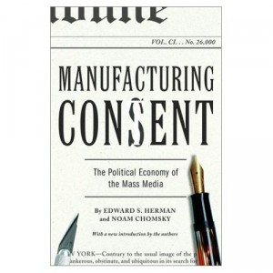

**Rating:** 2/5

Edward S. Herman and Noam Chomsky, *Manufacturing Consent: The Political Economy of the Mass Media* (New York: Pantheon Books, 2002).

Herman and Chomsky assert that the best way to understand modern mass media and how it operates is using a “propaganda model.” They introduce the model and then give a slew of case studies to support their view. Let’s start with the model itself. It’s not that they believe there’s some conspiracy or government department that forces certain stories to be treated in certain ways. They believe instead that the nature of culture and media as it exists today creates an environment where news gets propagandized just as if there were. Here’s how they describe it:

> A propaganda model focuses on this inequality of wealth and power and its multilevel effects on mass-media interests and choices. It traces the routes by which money and power are able to filter out the news fit to print, marginalize dissent, and allow the government and dominant private interests to get their messages across to the public. The essential ingredients of our propaganda model, or set of news “filters,” fall under the following headings: (1) the size, concentrated ownership, owner wealth, and profit orientation of the dominant mass-media firms; (2) advertising as the primary income source of the mass media; (3) the reliance of the media on information provided by government, business, and “experts” funded and approved by these primary sources and agents of power; (4) “flak” as a means of disciplining the media; and (5) “anticommunism” as a national religion and control mechanism. These elements interact with and reinforce one another. The raw material of news must pass through successive filters, leaving only the cleansed residue fit to print. They fix the premises of discourse and interpretation, and the definition of what is newsworthy in the first place, and they explain the basis and operations of what amount to propaganda campaigns.

Sorry for the long quote, but that one paragraph basically encapsulates the entire 400 pages. I think the model is intriguing and plausible—certainly the most plausible model I’ve encountered—but I couldn’t help but feel utterly unqualified to fully understand and judge their argument. First of all, the case studies are copious and verbose. I have to honestly say I did not read every word. It didn’t help that the case studies were all at least 30 years old and thus far removed from my lived experience. I just didn’t feel I was able to accurately judge how honest they were being with their data selection. It seemed to me like they just spent pages and pages and pages hammering home each of the above five points over and over again. I’m certain the book could have been cut in half. The writing was also as dry as sand. It’s not obtuse, but it’s sure not fun to read. (Don’t get me started about the book’s design, though at least the cover was awesome.)

If you’re a news hound or are particularly interested the subject of media objectivity, I’m sure you’ll get something out of the book (though it would help if you were at least 50 years old). Otherwise, read the above quote, ponder it for a bit, and then move on to find a different book on the subject. You’ll probably find this one a little painful.
