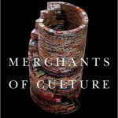

**Rating:** 4/5

 John B. Thompson, *Merchants of Culture: The Publishing Business in the Twenty-First Century* (Cambridge, UK: Polity, 2010)

This book discusses the history, current state, and possible future of trade publishing in the US and UK. This book does not discuss at length academic or STM publishing—he does that in other books—but instead focuses on mass-market fiction and non-fiction publishing.

If you work in the industry, there’s not too much here that you won’t already know. Some of the numbers may surprise you though. If you’re a writer, I think this book will help you establish realistic expectations.

Thompson focuses on three major changes in the industry: the growth of the retail chains, the rise of the agent, and the corporatization of the publisher. As independent booksellers gave way to large chains like Borders and Barnes & Noble, and then as virtual chains like Amazon came to the fore, retailers began to be able to exert greater and greater pressure on publishers for ever increasing discounts and other favorable terms. Agents began getting smarter about their business, which led to increasing advances and more fine-grained control over rights. And the consolidation and corporatization of major publishers has led to a demand for constant growth in what amounts to a flat market. This has led to an increasing focus on “big books” and what he calls “extreme publishing.”

The [long tail](http://en.wikipedia.org/wiki/Long_Tail "Wikipedia") is alive and well in the publishing world. Fewer and fewer books are making up a larger and larger percentage of sales. This of course raises concerns about the long-term diversity in the marketplace. Thompson does speak briefly about the rise of the e-book, and I happen to agree with him that the book as a physical object is not going away anytime soon.

This was an interesting read with lots of interesting figures and anecdotes. The book is well researched and (for the most part) well written. If you are interested in books and publishing, then you will find this book interesting. I have added his other books on the subject to my reading list.
