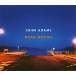
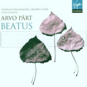
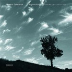

One thing about editing is that music can be very distracting, especially music with any sort of lyric. So, when I’m editing I do so generally in silence (or purely instrumental music if it’s a lighter text). I love it, then, when I get to the design and layout stage because I can listen to anything I want. Three CDs came up in my rotation today that I wanted to share—all of which from twentieth-century composers. (I’ll post more about my early-music collection later.)

**Rating:** 4/5

Title: *Road Movies*, Composer: [John Adams](http://en.wikipedia.org/wiki/John_Adams_%28composer%29 "Wikipedia Article"), Performer: Rolf Hind and others

Adams’s music is best described as [minimalist](http://en.wikipedia.org/wiki/Minimalist_music "Wikipedia") (though that term is very misleading). I am new to Adams, and I am told that this is not his greatest CD, but I have nevertheless really enjoyed listening to it. The concluding piece on the CD is *Phrygian Gates*, largely acclaimed as his greatest piano work. The pianist Rolf Hind is indefatigable. If you play the piano at all, your hands will feel exhausted after listening to his performance. The music is fast and energetic and I heartily recommend it.

**Rating:** 5/5

Title: *Beatus*, Composer: [Arvo Pärt](http://en.wikipedia.org/wiki/Arvo_Part "Wikipedia")

I thoroughly enjoy Pärt’s music! He’s an Estonian composer who is clearly influenced by [minimalism](http://en.wikipedia.org/wiki/Minimalist "Wikipedia") and [Gregorian Chant](http://en.wikipedia.org/wiki/Gregorian_chant "Wikipedia"). His main compositional technique is one he created and is called [tintinnabuli](http://en.wikipedia.org/wiki/Tintinnabuli "Wikipedia"). He has written a great deal of instrumental music, but my favourite Pärt music is his sacred choral works. The *Missa Syllabica* can sound monotonous at first, but it is perfect music for quiet reflection. There is great depth to the technique if you listen to it. My favourite pieces, though, have to be the opening *Statuit Ei Dominus* and the later *De Profundis*. If you want fundamentally Renaissance music with strong twentieth-century flavour, you owe it to yourself to explore Pärt’s work.

**Rating:** 5/5

Title: *Sonates pour violin solo*, Composer: [Eugène Ysaÿe](http://en.wikipedia.org/wiki/Eugene_Ysaye "Wikipedia"), Performer: [Thomas Zehetmair](http://en.wikipedia.org/wiki/Thomas_Zehetmair "Wikipedia")

Not being a violinist, I am sure I am missing some of the nuances of technique demonstrated in this music, but regardless, it is wildly impressive stuff. Just as a musician you can hear the incredible demands being placed on the performer. The composer was no slouch himself, widely considered one of the greatest violinists in all of history. All of the music on this CD is played by one man on one instrument. You *will* forget that at some point while you’re listening. The music is virtuosic in the extreme, so it may not be ideal for relaxation and meditation, but it will get the blood pumping, that’s for sure.
