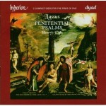

It’s an overly broad term, but essentially “Early Music” refers to Western music from “the beginning” through the sixteenth century (including some artists and genres of the seventeenth). This time period is where I spent most of my time and energy in university, and my honour’s and master’s theses focused on composers from this period. Unfortunately this music is not very widely listened to, so I hope to give those of you who haven’t had much exposure to this kind of music a few places to start—a whopping six places, actually. These CDs came up in my rotation today and I couldn’t ignore any of them. Some of them may be difficult to find. Start with your public library, and then check out the local university library (if you live close to one). Most public libraries have a way for you to suggest materials for purchase. Any of these CDs would be a valuable addition to a library collection.

All the CDs listed here I rate as 5 out of 5.

First up is a  recording of [Orlando di Lasso’s (1532–1594)](http://en.wikipedia.org/wiki/Orlando_di_Lasso "Wikipedia") *Penitential Psalms* by the group Henry’s Eight, published by Hyperion Dyad. [“Penitential”](http://en.wikipedia.org/wiki/Penitential_psalms "Wikipedia") is the name given to a specific group of psalms since as early as the sixth century AD: psalms 6, 32, 38, 51, 102, 130, and 143. Lasso’s setting of all seven is the most famous, but these psalms were set to music by many composers over the years. Lasso was a master of high Renaissance music and was very prolific. He composed music in just about every genre there was at the time, including Italian madrigals, French chansons, German lieder, and even Dutch songs. You just can’t find any other composer with a better grasp of vocal music. What I love about these particular pieces is their length (15 to 30 minutes each). Most Renaissance vocal music is either quite short or it’s a Mass. (Obviously there are exceptions, but it’s generally true.) I love the Renaissance style but by the time I’m really getting into a madrigal, for example, it’s over! These psalms are not the Mass (which I can almost recite verbatim in Latin now, despite not being a Catholic) but are sufficiently lengthy to really savour the textures and harmonies. This is very good reflection music, too. I come back to this recording often.

Next is a recording of [John Dowland’s (1563–1626)](http://en.wikipedia.org/wiki/John_Downland "Wikipedia") *First Booke of Songes* sung by Rufus Müller, accompanied by Christopher Wilson, and published by ASV Digital. Dowland was a composer, singer, and lutenist. He is best known for his collections of lute songs, or “ayres.” Müller’s tenor voice is exceptional and he sings each song with incredible sensitivity. Ornamentation is sparse but skillfully and beautifully done. Wilson’s lute playing is flawless. Together they they produce one of the best recordings of Dowland’s work I’ve heard. These songs are particularly accessible as they’re all in English. If you want to hear what seventeenth-century popular love songs sounded like, here’s where to start. Unfortunately Amazon no longer stocks this particular recording, but there are others out there.

Next is a contemporary of Dowland’s, [William Byrd (1540–1623)](http://en.wikipedia.org/wiki/William_byrd "Wikipedia"). He composed a lot of music in many different genres, but my favourite of his works are his three Catholic Masses for 3, 4, and 5 voices. It was dangerous to be a practicing Catholic in Tudor England. While born Protestant, Byrd associated closely with the Catholic church and other believers later in his life. These masses are undated, do not list the printer (who could have been killed for having printed them), and were kept as secret as possible. They are masterpieces. I have a particular fondness for the 3-voice mass. It’s simplicity only makes it even more gorgeous. This particular recording is sung by The Cardinall’s Musick, is published by ASV Digital, and also includes three exceptional organ works. This is the best recording I have ever heard of these works, primarily, I think, because they sing in a lower register and use counter-tenors instead of sopranos for the top voice.

Since we’re in the seventeenth century, let’s stay there a little longer. The fourth recording I want to mention is one by Cecilia’s Circle, the singer in which is one Janet Youngdahl, one of my thesis advisors. She has an exceptional voice and specializes in music of this period. I love to hear her sing. The recording in question is *Thy Hand Hast Done All This* which contains the cantata *Judith* and other works by [Elisabeth-Claude Jacquet de La Guerre (1665–1729)](http://en.wikipedia.org/wiki/Jacquet_de_la_Guerre "Wikipedia"), an exceptional woman composer that deserves more attention. It was published by Centaur Records. The recording contains three cantatas, a six-movement violin sonata, and a clavecin prelude. These are solo cantatas, a story told from the point of view and voice of a single participant. *Judith *is perhaps her most famous and [retells the deuterocanonical story of the same name](http://en.wikipedia.org/wiki/Judith "Wikipedia").

The last two CDs take us back another 500 years to the twelfth century.

First is a sample of Gregorian Chant, composed again by a female composer. [Hildegard von Bingen (1098–1179)](http://en.wikipedia.org/wiki/Hildegard_of_Bingen "Wikipedia") was an abbess who was also a writer, composer, philosopher, polymath, and visionary. She wrote books on biology (including, ironically, female sexuality), botany, and of course religious visionary texts. She also wrote one of the earliest known musical morality plays, entitled [Ordo Virtutum (Play of the Virtues)](http://en.wikipedia.org/wiki/Ordo_virtutum "Wikipedia"). The recording in question was done by a female group of Chant performers named [Sequentia](http://en.wikipedia.org/wiki/Sequentia_(music_group) "Wikipedia"), which again happens to include Janet Youngdahl. The recording was published by Deutsche Harmonia Mundi. It’s a tremendous recording with the lush vocals one expects from Sequentia as well as wonderful instrumental interludes. The liner notes provide a full transcription and translation of the text. In way of warning, this is indeed a play with multiple characters. One recurring character is Satan, and Satan is incapable of singing. (Song is divine.) So when you hear every once in a while this guy shouting Latin out of nowhere, that’s what’s happening. It’s intentional, and I think the performer (Franz-Josef Heumannskämper) does an excellent job.

Last, but most definitely not least, is a French recording entitled *Chansons de Troubadours et danses de Jongleurs* by a group named Millenarium and published by Ricercar Sabam. This is a collection of [troubadour songs](http://en.wikipedia.org/wiki/Troubadour "Wikipedia") and dances, again from the twelfth and thirteenth centuries. The reality is, we know very little about how this music was performed. (We obviously don’t have any recordings.) We have some written melodies but no accompaniments. (Intabulation didn’t really become popular until the fourteenth century.) We have some treatises, some personal accounts of performances, and a fair bit of iconography, but when it comes time for a performer to actually make some noise, there’s precious little guidance. For that reason, there are not many recordings of this music, but the Millenarium one is superb. Carole Matras is the singer and, man, what a voice! It is extremely flexible and the ornamentation is effortless. The instrumental music is equally satisfying. The only complaint is that the liner notes don’t translate the songs into English. They *do *translate them from the old French to modern French, though, for those that read French. I could listen to Carole’s voice all day long.

So there you go—six early music vocal recordings that range from the eleventh to the seventeenth centuries. Enjoy!
