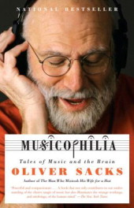

**Rating:** 4/5

Oliver Sacks, *Musicophila: Tales of Music and the Brain* (New York: Alfred A Knopf, 2008).

I received this book as a gift on my birthday back in 2008, but at the time I was studying for my comprehensive exams so I was somewhat over saturated (understatement!) with music readings. I’m sorry, Blais, but I’m just getting around to it now!

Dr. Oliver Sacks is a neurologist and a musician. He has written numerous best-selling books (like *Awakenings*, *The Man Who Mistook His Wife for a Hat*, and others). This one is about music. It’s a collection of case studies that look at the crazy ways our brain and music can interact. The book is laid out in four parts. The first (“Haunted by Music”) looks at conditions like musicogenic epilepsy, musical hallucinations, and “earworms.” The second part (“A Range of Musicality”) talks about amusia (the inability to perceive melody), musical savants, absolute pitch, and synesthesia.  The third (“Memory, Movement, and Music”) and fourth (“Emotion, Identity, and Music”) parts get more into music therapy and dementia. He looks at dystonia, but also Parkinsons, Alzheimers, Tourettes, and Williams syndromes.

The book is well written and absolutely accessible. You do not need to be a musician or a doctor to read and learn from it. It is nice to see music therapy get some serious page time. It also has an extensive bibliography. If you have any interest in music, music therapy, or the diseases mentioned, you will enjoy the read. I definitely plan on picking up some of his other books as I have the time.
