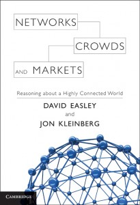

**Rating:** 4/5

David Easley and Jon Kleinberg, *Networks, Crowds, and Markets: Reasoning about a Highly Connected World* (Cambridge University Press, 2010).

I really, really enjoyed this book. I learned so much. As far as textbooks go—I’ve read my share—this one is very well organized. I thought the progression of topics was perfect.

The book is divided into seven overall parts:

1. Graph Theory and Social Networks
 Here they introduce the basics of graph theory and how it applies to social networks. It establishes the vocabulary and notation that are used throughout the book.
2. Game Theory
 As with the first part, the basics of game theory—including vocabulary and notation—is introduced. These are the two foundation sections of the text.
3. Markets and Strategic Interaction in Networks
 Here they combine the two and use the principles to explore markets (auctions, social networks, and other models).
4. Information Networks and the World Wide Web
 As the title suggests, this section uses the previously established principles to explore how information networks (particularly the Web) are structured. It also talks about search, page ranking algorithms, pricing of search-based advertising, and more.
5. Network Dynamics: Population Models
 Now the text starts to explore human interactions more specifically. It discusses things like information cascades and power laws.
6. Network Dynamics: Structural Models
 Here they talk more about how network structure influences the population models just introduced. It talks further about cascading behaviour, the small-world phenomenon, and epidemics.
7. Institutions and Aggregate Behavior
 Finally they try to look at everything a level higher. They discuss in great detail large-scale markets (like the stock market), voting, and even property rights.

The book is very accessible. It was written for an entry-level course, so the vocabulary is restrained and new terms and concepts are presented at a reasonable pace. The math is also reasonable and doesn’t play any large role until the second half of the book. I particularly like the “Advanced Material” sections. You can dive in or skip right past. And of course my favourite part of academic books: the bibliography. Unfortunately, most of the entries were journal articles, but I did find a few good books to add to my list. If you’re interested in the topics discussed, I think you’ll enjoy the book.
