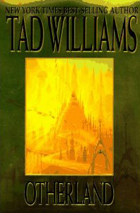

**Rating:** 5/5

Tad Williams, *Otherland* (4 vols: *City of Golden Shadow*, *River of Blue Fire*, *Mountain of Black Glass*, and *Sea of Silver Light*) (DAW, 1996, 1998, 1999, 2001).

An oldie but goodie. Published between 1994 and 2001, *Otherland* is a massive novel (3000ish pages across 4 volumes). It’s not a series. It really is one large story split up for reasons of practicality across multiple volumes. When I first started it and saw how long it was, I was not sure if Williams would be able to keep the pacing up and keep me interested over so many pages. I was very pleasantly surprised.

*Otherland* is fundamentally a sci-fi, but set in a world and time not so different from ours today. The setting of the story gives Williams a great deal of latitude, and he is very imaginative. The story has a huge number of characters, and one of the reasons the book is so long is because he spends so much time with each one. His characters are very heterogeneous and unique. I was thoroughly engaged throughout. I burned through the books in about 3 weeks. I just couldn’t stop reading. Don’t let the sci-fi label put you off. It’s not some far-future space opera. It is very human and down to earth.

I was concerned, too, about the ending. Ultimately, he did not drop the ball. Though not perfect (according to my personal tastes), it was on the whole satisfying and defensible. Since personal tastes vary so much, I can’t guarantee that you will love every aspect of the denouement, but I can promise it is not some lame Stephen King monstrous-demon-spider-from-outer-space ending either. Williams was juggling lots of threads, and in the end I was satisfied and impressed with his handling of them all. He is an excellent writer who creates vivid settings, characters you can relate to, and is very good at pacing and maintaining tension.

The book is not for younger children. The first book is very tame, but one of the primary antagonists is a serial killer, a very twisted sort. You spend more and more time with him as the books progress. Any cursing of the modern sort is extremely rare. There are a few teenage characters that use their own type of bad language, though.

I heartily recommend the series for people who like a longer, fully-developed story.
