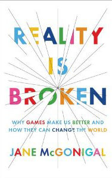

**Rating:** 3/5

Jane McGonigal, *Reality is Broken: Why Games Make Us Better and How They Can Change the World* (New York: Penguin Press, 2011).

This book was a bit of an emotional see-saw for me. I found myself agreeing then disagreeing with her almost page by page. But before I analyze, let me describe the book. It’s roughly 350 pages long and is divided into three parts: “Why Games Make Us Happy,” “Reinventing Reality,” and “How Very Big Games Can Change the World.” In the first she talks about the psychology of game play. The second and third get more specific about aspects highlighted in the first part. In these parts she provides case studies of exemplary games/projects that fulfill these goals. She also presents fourteen “fixes” for reality (though I don’t see them as fixes at all, simply statements of a problem). Now for my opinions. (Nobody has ever accused me of not having at least one.)

## First the personal

I am a gamer. I love games of all kinds. I have a particular fondness for face-to-face board & card games and will choose them over a computer game any day of the week. But I also love computer games and especially good RPGs. There was a time when I spent an inordinate amount of time online. (Everquest; Tarrew Marr; Go MK!) I’ve since chosen a different life path, but I do indeed have fond memories of those years and must admit that while I have never played a minute of WoW, I have wanted to.

## Then the good

McGonigal is well educated, very articulate, and exuberantly optimistic. The book is well written, well designed, and makes lots of good points. As a gamer, it is always good to see so articulately expressed the positive aspects of games, game play, and *gamefulness* (her word). Her discussions of the power and potential of crowdsourcing are great, and I agree that more can be done to leverage our collective knowledge.

## Now the not-so-good

I have a page full of notes and page references. I won’t go into most of it here. I just don’t have time to write a full-length essay, and I don’t want to outright discourage people from reading the book. I have my own opinions and others will have theirs. I’m always happy to discuss, though!

First is her grouping of **all** gamers into the single term *gamer*. This universal fallacy undermines her message. No, not all gamers like X or play Y or learn Z. Yet she ecstatically sings the praises of the superhuman, universal (and non-existent) “gamer.” She makes other similar generalizations that combine to make the book feel more like an apology (in the “a formal spoken or written defense” sense of the word), which hurts the book’s credibility. My primary objection, though, is as follows.

I have really enjoyed the writings of [Philip K. Dick](http://en.wikipedia.org/wiki/Philip_K._Dick). In the post-apocalyptic world of what is arguably his most famous work, * **Do Androids Dream of Electric Sheep?*, the dominant “religion” is that of Mercerism. The citizens all have “empathy boxes” that allow them to collectively experience the travails of one Wilbur Mercer. While on the surface it seems like a wonderful thing to simultaneously and viscerally share emotional experiences, the practical result of this “religion” is absolute isolation. People do not truly talk to each other or form deep and meaningful relationships with each other.

McGonigal asserts over and over again how games like *World of Warcraft* foster community, social bonds, and the ability to collaborate. (She does move on from WoW to ARGs and other live-action games, but her whole third chapter talks about and praises WoW specifically.) Apparently, if you calculate the total number of man-hours spent playing the game since it went live in 2004, it totals 5.93 **million** years.That’s roughly 30 million hours **a day** WoW players spend in the game. I in no way see how this can be spun as a “good thing.” There is nothing “productive” (that’s her word) about it. One of her main points here is that the primary skill one learns from WoW and games like it is collaboration. She calls it a “superpower” of the rising generation because of the following stat:  “By the age of twenty-one, the average young American has spent somewhere between two and three thousand hours reading books—and more than *ten thousand* hours playing computer and video games” (p. 266). BTW, that’s longer than kids spend in school from grade 5 to graduation. She invokes Malcolm Gladwell’s “rule of 10,000” and says that the rising generation will be expert in collaboration. Well, with stats like that, I’m not sure what else they’ll be expert in! I’m sorry, but when the world comes tumbling down, I want to be in a community of people that know how do more than simply work together. Hopefully somebody knows something about engineering, gardening, animal husbandry, self defense—you know, practical stuff like that, stuff you learn from reading books, going to school, and pursuing interests in the real world.

Now do not get me wrong. I am not trying to denigrate WoW specifically or games in general. (As I said at the beginning, “been there, done that.”) Games most definitely have a place. They are an essential diversion. They really can make us happy, bring us together, and teach skills that translate at least in part to the real world. They are **not**, however, the answer to the world’s problems. I take exception to her repeated assertion that gamers (there’s that word again) want to change the world. They just need a game to get them to do it. Well I’m a gamer, and I don’t need a game to make a difference. None of us do. If you want to make a difference right now, turn off the computer and **do** something—preferably **with somebody**. Spend more time with your SO and family. Give blood regularly. Volunteer at the library, a homeless shelter, or for some charitable organization you feel passionate about. If you’re a gamer, realistically look at how many hours you spend online. Commit to donating some portion of that time to physical human beings in your home or community. Read a book. Learn a new language. Learn a new skill. Discover board or card games you can play face-to-face with real people. Turn the whole experience into a game if that helps. Relationships with people you can reach out and physically touch are vital. Remember, when the lights go out, your guild can’t help you.

## And finally…

This is a good book that tackles difficult subject matter in a well-written way. Gamer or not (I think deep down, the vast majority of us are), you’ll enjoy the read. Despite my reservations, I appreciate her optimism and vision, and I agree in principle with a great deal of her assertions. The world needs to change. We’re the only ones that can make that happen. I just don’t think we need games to do it.
