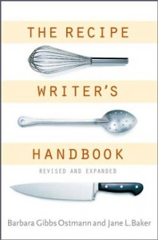

**Rating:** 4/5

 Barbara Gibbs Ostmann and Jane L. Baker, *The Recipe Writer’s Handbook: Revised and Expanded* (New York: John Wiley & Sons, 2001).

Well this is a book for editors. What it is is a style guide specifically for cookbooks. Should you use “green onions” or “scallions”? “Red pepper” or “red bell pepper”? What are the best practices for recipe testing? How should you manage metric vs. imperial measurements? What about copyright and plagiarism?

If you’re putting together a cookbook of any kind, this is an excellent reference for how to approach it. It has a tremendous bibliography that I’m looking forward to culling through. So while the book is not for everybody, if you’re interested in recipes and cookbooks, pick it up at your local library and take a look.
