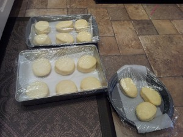
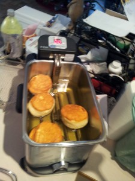
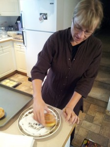
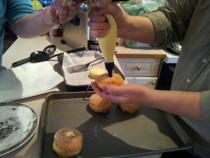
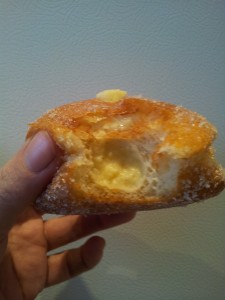

Adele bought me a deep fryer for Christmas! What does that mean? Doughnuts! Specifically, a delicious Italian pastry called bombolone. [I’ve made these before](../recipes-bomboloni "Recipes: Bomboloni"), but this is the first time I had access to vanilla beans and the proper “doppio zero” flour. (Costco sells vanilla beans for $1.20 each. A far cry from the $4.00 each at WalMart.) [The original recipe can be found here.](http://gracessweetlife.com/2011/08/bomboloni-alla-crema-krapfen-italian-cream-filled-donuts/) It’s the orange zest that really sets these doughnuts apart. You get that sweetness and richness but with that hint of freshness. I didn’t find the vanilla flavour to really stand out, so I’m not sure if in the future I’ll use the vanilla bean. This time around I didn’t use Grace’s pastry cream recipe. I wanted to see how [Gisslen’s recipe](../professional-baking-by-wayne-gisslen "“Professional Baking” by Wayne Gisslen") worked out. It worked out really well. It’s a stiff cream, but delicious, especially with the vanilla bean.

- Milk: 1 L (100%)
- Sugar: 125 g (12.5%)
- Vanilla bean: 1, split and seeded
- Egg yolks: 300 g (30%) [Yes, that’s approximately 15 eggs.]
- Cornstarch: 75 g (8%)
- Sugar: 125 g (12.5%)
- Butter: 60 g (6%)

Combine the milk, first portion of sugar, and vanilla beans and pod in a saucepan. Bring just to a boil, remove from heat, then cover and let sit for as long as an hour to let the vanilla really infuse the milk. In a separate bowl, beat together the yolks, cornstarch, and second portion of sugar until perfectly smooth. Temper the egg mixture, return everything to the pan, and bring to a boil, stirring constantly. (It has to boil to fully cook the starch.) Once thickened, remove from heat and stir in the butter. Pour the cream into a 9×13 or other shallow pan. Cover with plastic wrap, placing the wrap in direct contact with the surface of the cream to prevent a skin from forming. Chill until ready to use.

Bomboloni after rising, before frying

Bomboloni in the fryer

Roll them in sugar

Fill with cream

Admire

Enjoy
