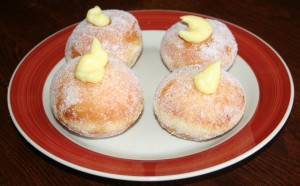

Original Recipe: <http://gracessweetlife.com/2011/08/bomboloni-alla-crema-krapfen-italian-cream-filled-donuts/>

Bomboloni are a traditional Italian pastry. This recipe worked great, and the resulting doughnuts were delicious! They were just so light and full of air. The orange zest added a little freshness and of course the pastry cream was marvelous! There wasn’t enough cream, though, to fill all the bomboloni the same. We did a few the proper way for pictures, but the rest just received a little dollop of cream injected through the side. You would have to double the pastry cream (at least) to fully fill them all. That said, even just the little bit of cream in the centre was “enough.” (Not that one can ever truly have enough pastry cream. I prefer to look at pastries as “pastry cream delivery systems.”)

Yield: I cut the dough to 2.75&Prime; circles and ended up with less than 3 dozen. (Can you believe I forgot to get an exact count?!)

Verdict: If you have a deep fryer, go and make these now. If you don’t have a deep fryer, you may wish to consider obtaining one just for the privilege of having fresh bomboloni from time to time. The kids went gaga over them. We’ll be making more this weekend. They are just that good.

