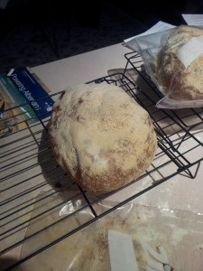
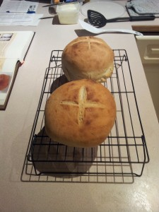
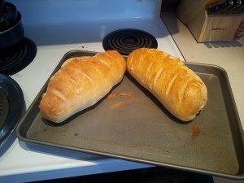
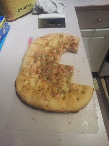

I am clearly insane. I know my body does better on almost no carbs. The pounds fall off, a host of minor annoying symptoms decrease, and I just feel better all around. So what do I go and do? I learn to make bread—good bread.

My favourite book acquisition of late has been [Wayne Gisslen’s *Professional Baking*](../professional-baking-by-wayne-gisslen "“Professional Baking” by Wayne Gisslen"). So far everything has worked out very well. He gives excellent theoretical and technical information followed by many scores of recipes. I just can’t get over how comprehensive it is! It’s the only cookbook I may ever need. All the recipes below come from that book.

Note: I omitted brioche and pizza dough from this post. I plan on making brioche tonight. If it works better this time, I’ll post about it. I also plan on making pizza for dinner. This time I’ll try to get pictures before we devour it. Stay tuned!

## Ciabatta

The first bread I tried was ciabatta, a classic Italian bread. What sets this bread apart is the olive oil. The dough is very sticky and should not be handled much, so getting a precise shape is difficult. It is also heavily dusted with flour. We brush a lot of it off before eating. This recipe makes three smaller loaves. I tried making two larger ones, but the dough was too heavy for the yeast. I got good rise while fermenting but nothing while proofing. You could easily make loaves small enough for turning into large sandwiches. The trouble is shaping the dough.

### Sponge

- Water: 480 g (72%)
- Yeast, fresh: 30 g (4%) [You can buy fresh yeast in bricks from your supermarket bakery. Here they cost about $2 for a brick and will keep in the fridge for a month, and apparently up to 4 months in the freezer. If using active dry yeast instead, use about half as much.]
- Bread flour: 450 g (67%)
- Virgin Olive Oil: 180 g (27%)

### Dough

- Salt: 15 g (2%)
- Bread flour: 220 g (33%)

First combine all the ingredients for the sponge (being sure to soften the fresh yeast or to activate the dried yeast) and beat for about five minutes. Set the sponge aside at room temperature for about an hour or until it has doubled in size.

Then stir it down, add the remaining ingredients, and beat for a few minutes until the dough is smooth. It will still be very soft and sticky. Cover and set aside again until doubled in volume (about an hour).

Scale the dough and place on greased and floured sheet pans, handling as little as possible. Shape as best you can and then sprinkle the top with flour. Proof until the dough doubles in volume and the flour starts to crack.

Bake at 425F (220C) for about 30 minutes until golden brown.

My first attempt at ciabatta bread

## Cuban

The next bread I tried the book called Cuban. If you go online and search “Cuban bread”, you get very different recipes, so I’m not sure what makes this bread Cuban, but it tastes great. This bread has more sugar in it than the others, it’s also the quickest to make (still measured in hours, though).

- Water: 465 g (62%)
- Yeast, fresh: 30 g (4%) [Calgary is at 3500 ft., so the rules of baking start to change. I increased the yeast to 40 g with my last batch and finally got the rise I wanted.]
- Bread flour: 750 g (100%)
- Salt: 15 g (2%)
- Sugar: 30 g (4%)

Soften/activate your yeast in the water, add the salt and sugar to the water to ensure even distribution throughout the dough, and then mix everything together in your mixer. Process for about 12 minutes at the lowest speed. Cover the dough and let it ferment for an hour at about 80F (27C).

Divide the dough into two balls. Round them, place them on the sheet, and score the top with a cross. Proof until doubled in size. Bake at 400F (200C) until nice and golden brown (about 20 minutes).

My first loaves of Cuban bread

## French

Then I finally tried a nice French bread. My wife’s cousin Ellen already makes the best French bread, and I have her recipe, but I thought I’d try the book one, too. I love what the egg wash does for the crust. This is by far my favourite bread. I could eat loaves of the stuff all day every day. Here’s the sponge version of the recipe.

### Sponge

- Bread flour: 250 g (33%)
- Water: 250 g (33%)
- Yeast, fresh: 15 g (2%)
- Malt syrup: 8 g (1%)

### Dough

- Bread flour: 500 g (67%)
- Water: 202 g (27%)
- Salt: 13 g (1.75%)

Soften/activate the yeast in the heated water with the syrup. Mix it with the flour and let ferment for 4 hours at 75F (24C) or overnight at 65F (18C).

Add the remaining ingredients, blend well, then let ferment for 30 minutes at 80F (27C).

Scale the dough (makes 2 large loaves or 4 mini-loaves) and proof on sheet pans until doubled in volume. Score the tops if you wish, brush with egg wash, and then bake at 425F (218C) until nicely browned. The book says to bake with steam for the first 10 minutes, but I use a baking stone and am loath to get it wet. Moisture can apparently cause them to crack. I need to do some research before injecting steam.

My first attempt at French bread (2 loaves)

My second attempt at French bread (4 mini-loaves)

## Focaccia

Next up, herb focaccia. This was not the light cake-like focaccia I’ve seen at the supermarket. This is a denser, tougher bread that appears to be more traditional. This would make killer bread sticks to eat with soup.

### Sponge

- Water: 175 g (21%)
- Yeast, fresh: 4 g (0.5%)
- Flour: 225 g (29%) [In this one instance the book doesn’t specify bread flour, so I used all-purpose.]

### Dough

- Flour: 575 g (71%)
- Water: 400 g (50%)
- Yeast, fresh: 4 g (0.5%)
- Salt: 15 g (1.75%)
- Olive oil: 30 g (3.5 %)

Mix the ingredients for the sponge and let ferment for 8 to 16 hours at 70F (21C). Then mix in the rest of the ingredients to make a smooth dough and let ferment for a further 30 minutes at 80F (27C).

This recipe makes enough dough to fill a standard cookie sheet. Oil the pan with olive oil and roll and stretch the dough to fit the pan. Proof until doubled in thickness

Top with 2 oz (60 mL) of olive oil. With your fingers press heavily into the dough at regular intervals. Top with a tablespoon of fresh rosemary and coarse salt to taste. Bake at 400F (200C) for 20–30 minutes.

Focaccia bread topped with olive oil, rosemary, and coarse salt. Obviously I couldn’t get the camera out fast enough.
