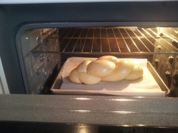
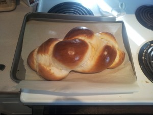

Now that we have an actual home with a little space, we were finally able to throw a Christmas party this year. Many couldn’t make it, but we really enjoyed spending time with those that could. We also took the opportunity to do some more holiday baking, but of things that people didn’t get on [the baking plates](../recipes-christmas-2012-baking-plates "Recipes: Christmas 2012: Baking Plates"). Also unlike the plates, I can actually share these recipes. Unfortunately I did not take pictures!! I do apologize. That would have been nice 🙁

# Cookies

All the cookie recipes come from the [Gisslen book “Professional Baking.”](../professional-baking-by-wayne-gisslen "“Professional Baking” by Wayne Gisslen")

## Cinnamon Cookies

Despite my aversion to trying a recipe for the first time for an important event, I decided that the cinnamon cookies looked straightforward enough that I could risk it. While they are a decent cookie, I wouldn’t call them remarkable. I’m not sure that I’ll bother making them again.

- Butter: 500 g (80%)
- White sugar: 250 g (40%)
- Brown sugar: 250 g (40%)
- Salt: 5 g (0.8%)
- Cinnamon: 10 g (1.7%)
- Eggs: 90 g (15%)
- Milk: 30 g (5%)
- Pastry flour: 625 g (100%)

Cream together the butter, sugar, and spices until smooth and creamy. Add the eggs and milk and mix until smooth. Then add the flour to form the dough. I rolled the dough into balls, like gingersnaps, and then rolled them in a mix of cinnamon-sugar (quarter cup of white sugar plus a teaspoon of cinnamon) and then pressed the balls flat on the pan. Bake for 10 minutes at 375F.

## Coconut Macaroons (meringue style)

This was another first-time recipe. (I was pretty bold!) The meringue style produces a crisp cookie. Gisslen also provides a chewy coconut macaroon recipe that I will try later.

- Egg whites: 250 g (40%)
- Cream of tartar: 2 g (0.3%)
- Sugar: 625 g (100%)
- Vanilla: 15 g (2.5%)
- Dried, unsweetened, fine-to-medium coconut: 500 g (80%)

The best part of baking percentages is you can scale the recipe based on difficult-to-measure-accurately ingredients like egg whites. Simply weigh the egg whites, multiply by 100, and divide by 40. That will tell you what 100% equals. Do the math from there.

To prepare, whip the egg whites, cream of tartar, and vanilla to soft peaks. Gradually add the sugar while beating until the meringue is stiff and glossy. Fold in the coconut. You’re supposed to pipe the cookies out of a star-tipped bag, but my attachments were too small to extrude the thick mixture. (I could only find medium-flaked coconut.) So I just spooned them out onto the pan and it worked fine. Bake for 20–30 minutes at 300F.

## Gingerbread Cookies

I’ve made way too many gingersnaps lately. I really like gingerbread, so I’ve been dying to try this recipe. This was a good opportunity. Maybe I did something wrong, but I found the dough to be extremely sticky. It made rolling the dough out very frustrating. It was also difficult to use my cookie cutters because the dough kept sticking to the cutter. The cookies also swell a little bit, so shapes with fine features won’t go so well. I finally just did plain rounds cut out with a glass. The resulting cookies are nice and soft and quite tasty.

- Butter: 340 g (45%)
- Brown sugar: 250 g (33%)
- Baking soda: 5 g (0.7%)
- Salt: 4 g (0.5%)
- Ginger: 5 g (0.7%)
- Cinnamon: 2 g (0.25%)
- Cloves, ground: 1 g (0.12%)
- Eggs: 110 g (15%) [1 large egg usually weighs right around 55 grams.]
- Molasses: 340 g (45%)
- Pastry flour: 750 g (100%)

Cream together the butter, sugar, and spices. Then add the eggs and molasses. Finally add the flour. Roll the dough out, cut the shapes you want, then bake  375F for approximately 10 minutes. (I can’t seem to remember exactly how long I kept them in for. The book doesn’t give an exact time.)

# Cakes

## Oreo Marshmallow Bars

[I’ve made these before.](../aib-no-bake-chewy-cookies-and-cream-bars-redux "AiB: No-Bake Chewy Cookies and Cream Bars Redux") These were a real hit with kids and grownups alike. I should have made two pans. Make them today. Your kids will love you 🙂

## Cinn-a-bun Cheesecake

[I’ve also made this before.](../aib-cinn-a-bun-cheesecake "AiB: Cinn-a-bun Cheesecake") The last time I made it I only had a 10-inch springform, so I could only do two cheesecake layers. This time I had an 8-inch pan, but there was far too much batter. It looks like a 9-inch pan would be perfect. Because I was baking so much other stuff, I couldn’t remove my baking stone. That meant that the cake wasn’t baked with a water bath. The bath just helps the top not get all crusty. While I wasn’t thrilled with how it looked, I’m assured it tasted excellent. (I personally hate cheesecake.)

## Oreo Chocolate Truffle Tart

[I’ve made this before, too.](../aib-oreo-chocolate-truffle-tart-with-chocolate-glaze "AiB: Oreo Chocolate Truffle Tart with Chocolate Glaze") I had forgotten how much I liked this tart. It’s really easy to make and gives you a rich chocolate result without the pain of the [chocolate mousse cake](../aib-chocolate-mousse-cake "AiB: Chocolate Mousse Cake"), for example. I used high-quality dark chocolate, so the chocoholics loved it, but it’s not ideal for most kids. I’ll be making this for dessert at Christmas dinner.

# Breads

All the bread recipes come from the [Gisslen book “Professional Baking.”](../professional-baking-by-wayne-gisslen "“Professional Baking” by Wayne Gisslen")

## Cuban Bread

[I’ve made this before.](../recipes-bread-week "Recipes: Bread Week") I’m told that this is indeed the type of bread you will find in Cuba. It’s my go-to recipe for a quick white bread. It gives a nice texture and flavour. (It does taste different from traditional white bread.) It only takes two hours from mixer to oven, so it’s the fastest bread recipe I have. If you’re new to bread making, then this is a great place to start.

## Milk Bread Rolls

I’ve already made [brioche](../recipes-pizza-brioche-and-angel-food "Recipes: Pizza, brioche, and angel food"), but I wanted to try the same rolls with a different bread. I tried Gisslen’s milk bread recipe. The dough is quite stiff—it gave my mixer a workout—and doesn’t rise much. Since this is my first time making it, I can’t be sure whether that’s the recipe or my preparation. Like I did with the brioche, I made cloverleaf rolls, where you put three small balls of dough in each muffin cup and then they rise and bake together. It makes these really nice pull-apart rolls. The rolls are firmer than the brioche, but they were still very good. If I have the time, though, I think I’ll still stick with brioche in the future. I cut this recipe in half and still made two dozen rolls. A kilogram of flour is a lot!

- Yeast, fresh: 30 g (3%) [I used 35 g and could use as much as 40 g to get the rise I want. Calgary is higher elevation. Remember that if you want to use active dry yeast, cut the amount in half.]
- Milk: 500 g (50%)
- Bread flour: 1000 g (100%)
- Sugar: 100 g (10%)
- Salt: 20 g (2%)
- Eggs: 100 g (10%)
- Butter: 150 g (15%)
- Malt syrup: 10 g (1%) [Malt syrup is super difficult to spoon out and measure. I need to find an empty squeeze bottle I can use. For now, I don’t bother measuring. I just take a small spoonful and add it to the water.]

This you can prepare straight, with no sponge. Just put everything in your mixer and mix for 10 to 15 minutes at second speed. Let ferment for 60 to 90 minutes at about 77F. Use whatever method you want to form your rolls, proof, then wash with egg before baking at 425F for 15 minutes. (I think that’s how long I baked them for. Again, the book doesn’t give an exact time. It may have been closer to 20.)

## Challah

This was my first attempt at challah, and I remembered to take a picture! Challah is a hebrew egg bread. It has a very specific taste. Lots of people loved it, but it wasn’t quite my cup of tea. Given the amount of dough, I probably should have cut it in half and made two loaves. That would have let me make the strands thin and long enough to get a more attractive braid.

- Water: 200 g (40%)
- Yeast, fresh: 20 g (3.75%)
- Bread flour: 500 g (100%)
- Egg yolks: 100 g (20%) [Took me four yolks.]
- Sugar: 38 g (7.5%)
- Malt syrup: 2 g (0.6%)
- Salt: 10 g (1.9%)
- Vegetable oil: 62 g (10%) [I used canola.]

Just throw everything in the mixer and mix for 10 minutes at second speed. Let ferment for 90 minutes at 80F. Make up the bread with whatever braid you want. (I can’t go into it here. [Buy the book!](../professional-baking-by-wayne-gisslen "“Professional Baking” by Wayne Gisslen")). Proof, wash with egg, then bake at 400F until done. I wish I wrote down how long it took me! I’d guess around 25 minutes.

Challah in the oven

Challah, baked

Thanks again to everyone that came to the party. It was so nice to see you all! We’ll have to do it again soon. Merry Christmas!!
