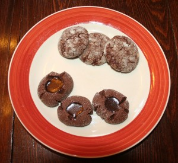

Original recipe: <http://gracessweetlife.com/2010/05/dark-chocolate-almond-crackles-chocolate-thumbprints/>

Made two different kinds of cookies today: Dark Chocolate Almond Crackles and Chocolate Thumbprints.

 

Almond Crackles: This is a straightforward recipe except for the blanched almonds. What a pain! It took 30+ minutes just to blanch 1 cup. You can buy blanched, but I’m told you lose a lot of flavour if you don’t do it yourself just before using them. \*shrugs\* The cookie is just not worth it to me if I have to blanch almonds. Perhaps next time I’ll try it with the skins on and see if that’s really bad. We’ll see. Note that the batter is really runny (more like a brownie consistency), so you really do have to refrigerate the dough for that hour or so before using.

Chocolate Thumbprints: Again, a simple recipe, but the problem here was making the indentations. Maybe my wooden spoon was too wide, but that vast majority of the cookies did not hold their shape as I pressed them. By the end, only a handful of cookies held the ganache as I hoped. The cookies were right around 2 tsps of batter each, as the recipe says, but I think they need to be bigger. The ganache was fine, but runny. It never fully set at room temperature. It’s a nice idea, and the kids love them, but ultimately they were a little underwhelming.

Actual yield: The yields given in the recipes are not what I got. I got 43 thumbprints and 36 crackles.

Verdict: The cookies taste good, but neither of them were “Wow! I have to put this on my Christmas baking plate every year!”
