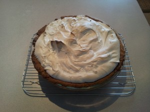

Original recipe: <http://gracessweetlife.com/2013/01/lemon-meringue-tart/>

You will notice that I get a lot of recipes from [Grace Langlois’s blog](http://gracessweetlife.com). That’s because finding good recipes online can be a real bear. When you find a person who posts as regularly as Grace, who knows how to write good recipes that you can replicate with relative certainty, and who, on top of it all, is responsive to questions, you stick with them! If I want a recipe, the first place I’ll go is [Grace’s blog](http://gracessweetlife.com) and then branch out from there.

I love lemon meringue pie. Many people in my family love lemon meringue pie. So when Grace posted a recipe, I jumped on it. A while back I tried [a recipe for lemon custard](../aib-lemon-meringue-custard-with-butter-cookies "AiB: Lemon Meringue Custard with Butter Cookies"). It was a disaster. That’s an example of a recipe that looked great but was not communicated well. (The butter cookie recipe is the bomb, though!) I am happy to report that Grace’s recipe is a total winner.

What makes this a tart instead of a pie is really the crust. It’s a firm shortbread, the slices of which you can pick up with your hands and eat. This makes it perfect for tart pans with removable bottoms. (It needs to be deep, though!)

A few notes:

- This recipe makes a lot of filling. A standard 9-inch tart pan is nowhere large enough. You want something about 2 inches deep. I had a deep pan that was 10 inches in diameter and it worked great.
- I don’t have a food processor, and our Vitamix (though awesome) cannot process the dough properly. I just grabbed a pastry cutter and did the mixing by hand. It works fine, but the second time I needed an additional half-tablespoon of milk to get the dough to come together.
- Though the texture of the filling is pretty much perfect, the two times I’ve made it, the surface of the baked filling was unappealing. I think it’s because I used a hand mixer to mix the filling. That created a fair bit of foam, which stayed on top and baked. I could be wrong, though. We’ll see when I make it a third time.
- The filling sets suddenly. Check it at 30 minutes and then every 5 minutes after. You don’t want to overbake it.
- Italian meringue is not trivial to make. The problem is the syrup. If you don’t do it just right, you get a crystallized mess. After two failed attempts, I gave up. (I will have to perfect my syrup-making techniques another day.) Instead I went to my trusty [Gisslen book](../professional-baking-by-wayne-gisslen "“Professional Baking” by Wayne Gisslen") (have I told you lately how much *I love this book*?!) and re-read the section on meringues. I chose to go with a Swiss meringue (2 parts sugar to 1 part egg white; combine in a double-broiler and, while mixing gently, heat the mixture to 120F; pour into your stand mixer and beat to firm peaks). It’s not as stable as the Italian meringue (which is apparently the most stable of meringues), but it’s certainly a step up from your standard meringue.

This recipe is somewhat time intensive (you should give yourself 6–8 hours), but it’s not complicated or labour intensive, and the final result is definitely worth it. I’m afraid I don’t have any pictures of the pie sliced because this one is being given away. But when I make it a third time, I’ll be sure to post them.

Yield: One 9-inch round, 2-inch deep tart.

Verdict: Absolute keeper!

 Lemon Meringue Pie

Lemon Meringue Pie
