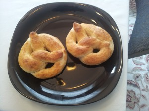
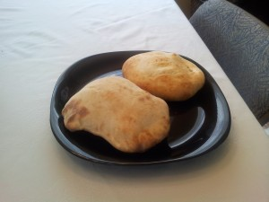

I made soft pretzels and pita bread today. The pretzels don’t quite taste like pretzels I’ve had in the past, but they were still delicious. The pita bread turned out really well for a first try. The pockets formed beautifully. I did half directly on the baking stone and half on a dry baking sheet. They both worked out great. I didn’t have the whole wheat flour for the pita, but the all-white-flour version worked out just fine. The below recipes come from [the Gisslen book](../professional-baking-by-wayne-gisslen "“Professional Baking” by Wayne Gisslen").

Pretzels

Pita

### Pretzels

- Water: 325 g (65%)
- Yeast, fresh: 11 g (2.25%)
- Bread flour: 375 g (75%)
- Pastry flour: 125 g (25%)
- Salt: 3 g (0.6%)
- Sugar: 10 g (2%)

Throw all the ingredients in the mixer and mix until developed. Let rest, covered, for approx. 45 minutes. Scale to 150 g pieces, roll out to about 75 cm long, form, wash\*, salt, and bake at 500F for 8 minutes or so on a parchment-lined pan, until well browned. Dip in or brush with melted butter when done and let drain on a wire rack.

\* Wash consists of 250 g water to 30 g baking soda. Simply dip the pretzel in the mixture before placing on the pan.

### Pita

- Water: 435 g (58%)
- Yeast, fresh: 30 g (4%)
- Bread flour: 625 g (83%)
- Whole wheat flour: 125 g (17%)
- Salt: 15 g (2%)
- Sugar: 22 g (3%)
- Yogurt, plain, low-fat: 90 g (12.5%)
- Oil, preferably olive: 30 g (4%)

Throw all the ingredients in the mixer and mix until developed. Let ferment until doubled (approx. 1.5 hours). Scale to 90 g units, round, and bench rest. Then roll each unit out into a circle about 5 in in diameter. Bake directly on a stone or on a dry pan at 500F for about 5 minutes, until golden around the edges. Don’t overbake them! They should be soft when cooled.
