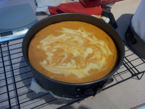

Original recipe: <http://www.womansday.com/recipefinder/swirled-pumpkin-cheesecake-recipe-122759>

I’m running a little behind on my blog postings. I baked this cake back on my birthday along with a [neapolitan mousse cake](../recipes-neapolitan-mousse-cakes "Recipes: Neapolitan Mousse Cake(s)") and an [angel food cake](../recipes-pizza-brioche-and-angel-food "Recipes: Pizza, brioche, and angel food"). There are a half-dozen people in our group who also have birthdays in May, so I brought in cake for all of us. This pumpkin cheesecake was a new one for me, and it turned out marvelously! It was super creamy and full of that pumpkin pie flavour. This is a definite keeper. The only adjustment I made was to use hazelnuts instead of pecans for the crust. I also used a 9&Prime; springform pan instead of a pie pan. If you like cheesecake and you like pumpkin pie, then go make this now.

Out of the oven
