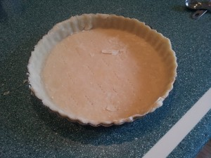
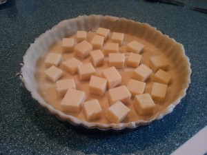

Original Recipe: <http://foododelmundo.com/2009/11/15/quiche-with-a-perfect-crust/>

I’ve made quiche before, but I didn’t want to buy pre-made shells this time, so I found this recipe and gave it a try. It worked out really well! Two cups of liquid is too much. One and a half is plenty. I used Swiss Gruyère cheese, which has a slightly higher fat content than plain Swiss, so that added to the final liquid amount. The crust was good, but it didn’t seem to get all crispy. I’m sure that’s partly because of the excess liquid and fat. I’m going to make another one this week with less liquid, a little less Gruyère, and see what I get. It was delicious, though!

Yield: 1 × 9&Prime; quiche

Verdict: Keeper

Quiche: Just the shell

Quiche: Shell with cheese

Quiche: Finished
