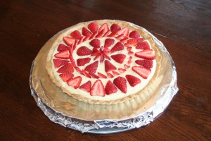
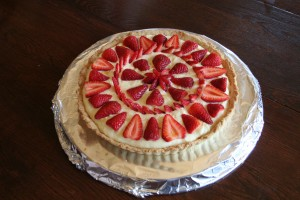

Original recipe: <http://gracessweetlife.com/2011/06/crostata-di-fragole-con-crema-pasticcera-e-chantilly-strawberry-tart/>

This recipe turned out beautifully! The pastry was delicious, it didn’t break when transferring, the pastry cream worked the very first time, and all together it was just gorgeous!

I didn’t have vanilla beans, so I used 2 tsp of excellent Mexican vanilla extract. Next time I’ll add a third teaspoon. It was also just the littlest bit not sweet enough. I used normal sugar instead of caster sugar, so in the future I’ll add a few more tablespoons of sugar. There was lots of cream—enough for Adele and Ellen to enjoy with a spoon after the tart was full. Adele did the strawberry design and we had lots left for piling on when served. The pastry turned out to be very tasty. I will keep this recipe in mind next time I want to do some sort of layered desert and need a crispy, firm base. It was so aromatic when it came out of the oven!

This is a great, light dessert. It takes time to prepare, but it’s a very straightforward recipe. As always, if *I* can do it, *anybody* can!

Actual yield: 1 11&Prime; tart

Verdict: Superb!

P.S. Here are some pictures! My shots don’t look anything like Grace’s (the original recipe poster), but they’re better than nothing. I didn’t have a cake tray big enough, so we just covered a pizza pan in foil.

